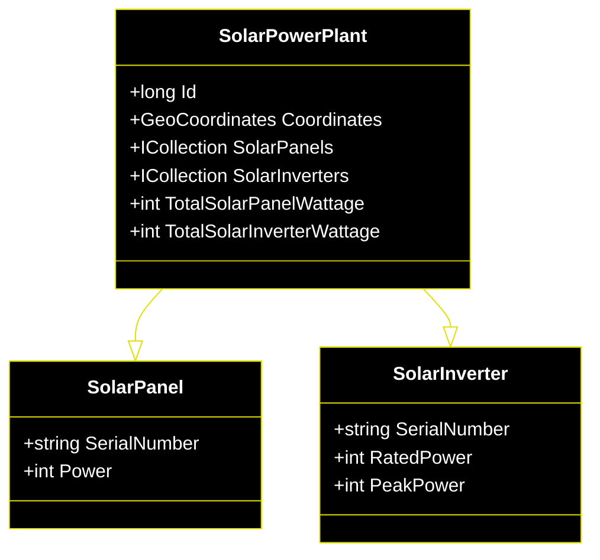

# Jambo Web API
<p align="center">

</p>

## Overview
This project serves as an experimental exploration of the ASP.NET Core framework within the context of photovoltaic solar energy. It focuses on three core model classes: solar panels, solar inverters, and solar power plants.

## Class Diagram


## 3D Representation
```stl
solid Mesh
  facet normal 0.000000 -1.000000 0.000000
    outer loop
      vertex -4.000000 -2.000000 -1.000000
      vertex 4.000000 -2.000000 -1.000000
      vertex 4.000000 -2.000000 1.000000
    endloop
  endfacet
  facet normal 0.000000 -1.000000 0.000000
    outer loop
      vertex -4.000000 -2.000000 -1.000000
      vertex 4.000000 -2.000000 1.000000
      vertex -4.000000 -2.000000 1.000000
    endloop
  endfacet
  facet normal 0.000000 1.000000 0.000000
    outer loop
      vertex -4.000000 2.000000 -1.000000
      vertex 4.000000 2.000000 1.000000
      vertex 4.000000 2.000000 -1.000000
    endloop
  endfacet
  facet normal 0.000000 1.000000 0.000000
    outer loop
      vertex -4.000000 2.000000 -1.000000
      vertex -4.000000 2.000000 1.000000
      vertex 4.000000 2.000000 1.000000
    endloop
  endfacet
  facet normal -1.000000 0.000000 0.000000
    outer loop
      vertex -4.000000 -2.000000 -1.000000
      vertex -4.000000 2.000000 1.000000
      vertex -4.000000 2.000000 -1.000000
    endloop
  endfacet
  facet normal -1.000000 0.000000 0.000000
    outer loop
      vertex -4.000000 -2.000000 -1.000000
      vertex -4.000000 -2.000000 1.000000
      vertex -4.000000 2.000000 1.000000
    endloop
  endfacet
  facet normal 1.000000 0.000000 0.000000
    outer loop
      vertex 4.000000 -2.000000 -1.000000
      vertex 4.000000 2.000000 -1.000000
      vertex 4.000000 2.000000 1.000000
    endloop
  endfacet
  facet normal 1.000000 0.000000 0.000000
    outer loop
      vertex 4.000000 -2.000000 -1.000000
      vertex 4.000000 2.000000 1.000000
      vertex 4.000000 -2.000000 1.000000
    endloop
  endfacet
  facet normal 0.000000 0.000000 -1.000000
    outer loop
      vertex -4.000000 -2.000000 -1.000000
      vertex -4.000000 2.000000 -1.000000
      vertex 4.000000 2.000000 -1.000000
    endloop
  endfacet
  facet normal 0.000000 0.000000 -1.000000
    outer loop
      vertex -4.000000 -2.000000 -1.000000
      vertex 4.000000 2.000000 -1.000000
      vertex 4.000000 -2.000000 -1.000000
    endloop
  endfacet
  facet normal 0.000000 0.000000 1.000000
    outer loop
      vertex -4.000000 -2.000000 1.000000
      vertex 4.000000 2.000000 1.000000
      vertex -4.000000 2.000000 1.000000
    endloop
  endfacet
  facet normal 0.000000 0.000000 1.000000
    outer loop
      vertex -4.000000 -2.000000 1.000000
      vertex 4.000000 -2.000000 1.000000
      vertex 4.000000 2.000000 1.000000
    endloop
  endfacet
  facet normal 0.000000 -1.000000 0.000000
    outer loop
      vertex -1.000000 -1.000000 1.000000
      vertex 1.000000 -1.000000 1.000000
      vertex 1.000000 -1.000000 15.000000
    endloop
  endfacet
  facet normal 0.000000 -1.000000 0.000000
    outer loop
      vertex -1.000000 -1.000000 1.000000
      vertex 1.000000 -1.000000 15.000000
      vertex -1.000000 -1.000000 15.000000
    endloop
  endfacet
  facet normal 0.000000 1.000000 0.000000
    outer loop
      vertex -1.000000 1.000000 1.000000
      vertex 1.000000 1.000000 15.000000
      vertex 1.000000 1.000000 1.000000
    endloop
  endfacet
  facet normal 0.000000 1.000000 0.000000
    outer loop
      vertex -1.000000 1.000000 1.000000
      vertex -1.000000 1.000000 15.000000
      vertex 1.000000 1.000000 15.000000
    endloop
  endfacet
  facet normal -1.000000 0.000000 0.000000
    outer loop
      vertex -1.000000 -1.000000 1.000000
      vertex -1.000000 1.000000 15.000000
      vertex -1.000000 1.000000 1.000000
    endloop
  endfacet
  facet normal -1.000000 0.000000 0.000000
    outer loop
      vertex -1.000000 -1.000000 1.000000
      vertex -1.000000 -1.000000 15.000000
      vertex -1.000000 1.000000 15.000000
    endloop
  endfacet
  facet normal 1.000000 0.000000 0.000000
    outer loop
      vertex 1.000000 -1.000000 1.000000
      vertex 1.000000 1.000000 1.000000
      vertex 1.000000 1.000000 15.000000
    endloop
  endfacet
  facet normal 1.000000 0.000000 0.000000
    outer loop
      vertex 1.000000 -1.000000 1.000000
      vertex 1.000000 1.000000 15.000000
      vertex 1.000000 -1.000000 15.000000
    endloop
  endfacet
  facet normal 0.000000 0.000000 -1.000000
    outer loop
      vertex -1.000000 -1.000000 1.000000
      vertex -1.000000 1.000000 1.000000
      vertex 1.000000 1.000000 1.000000
    endloop
  endfacet
  facet normal 0.000000 0.000000 -1.000000
    outer loop
      vertex -1.000000 -1.000000 1.000000
      vertex 1.000000 1.000000 1.000000
      vertex 1.000000 -1.000000 1.000000
    endloop
  endfacet
  facet normal 0.000000 0.000000 1.000000
    outer loop
      vertex -1.000000 -1.000000 15.000000
      vertex 1.000000 1.000000 15.000000
      vertex -1.000000 1.000000 15.000000
    endloop
  endfacet
  facet normal 0.000000 0.000000 1.000000
    outer loop
      vertex -1.000000 -1.000000 15.000000
      vertex 1.000000 -1.000000 15.000000
      vertex 1.000000 1.000000 15.000000
    endloop
  endfacet
  facet normal 0.000000 -0.866025 0.500001
    outer loop
      vertex -10.000000 -8.910254 19.566988
      vertex 10.000000 -8.910254 19.566988
      vertex 10.000000 -8.410254 20.433012
    endloop
  endfacet
  facet normal 0.000000 -0.866025 0.500001
    outer loop
      vertex -10.000000 -8.910254 19.566988
      vertex 10.000000 -8.410254 20.433012
      vertex -10.000000 -8.410254 20.433012
    endloop
  endfacet
  facet normal 0.000000 0.866026 -0.500000
    outer loop
      vertex -10.000000 8.410254 9.566987
      vertex 10.000000 8.910254 10.433013
      vertex 10.000000 8.410254 9.566987
    endloop
  endfacet
  facet normal 0.000000 0.866026 -0.500000
    outer loop
      vertex -10.000000 8.410254 9.566987
      vertex -10.000000 8.910254 10.433013
      vertex 10.000000 8.910254 10.433013
    endloop
  endfacet
  facet normal -1.000000 0.000000 0.000000
    outer loop
      vertex -10.000000 -8.910254 19.566988
      vertex -10.000000 8.910254 10.433013
      vertex -10.000000 8.410254 9.566987
    endloop
  endfacet
  facet normal -1.000000 0.000000 0.000000
    outer loop
      vertex -10.000000 -8.910254 19.566988
      vertex -10.000000 -8.410254 20.433012
      vertex -10.000000 8.910254 10.433013
    endloop
  endfacet
  facet normal 1.000000 0.000000 0.000000
    outer loop
      vertex 10.000000 -8.910254 19.566988
      vertex 10.000000 8.410254 9.566987
      vertex 10.000000 8.910254 10.433013
    endloop
  endfacet
  facet normal 1.000000 -0.000000 0.000000
    outer loop
      vertex 10.000000 -8.910254 19.566988
      vertex 10.000000 8.910254 10.433013
      vertex 10.000000 -8.410254 20.433012
    endloop
  endfacet
  facet normal 0.000000 -0.500000 -0.866025
    outer loop
      vertex -10.000000 -8.910254 19.566988
      vertex -10.000000 8.410254 9.566987
      vertex 10.000000 8.410254 9.566987
    endloop
  endfacet
  facet normal 0.000000 -0.500000 -0.866025
    outer loop
      vertex -10.000000 -8.910254 19.566988
      vertex 10.000000 8.410254 9.566987
      vertex 10.000000 -8.910254 19.566988
    endloop
  endfacet
  facet normal 0.000000 0.500000 0.866025
    outer loop
      vertex -10.000000 -8.410254 20.433012
      vertex 10.000000 8.910254 10.433013
      vertex -10.000000 8.910254 10.433013
    endloop
  endfacet
  facet normal -0.000000 0.500000 0.866025
    outer loop
      vertex -10.000000 -8.410254 20.433012
      vertex 10.000000 -8.410254 20.433012
      vertex 10.000000 8.910254 10.433013
    endloop
  endfacet
  facet normal 0.000000 -0.866025 0.500001
    outer loop
      vertex -10.000000 -8.910254 19.566988
      vertex 10.000000 -8.910254 19.566988
      vertex 10.000000 -8.410254 20.433012
    endloop
  endfacet
  facet normal 0.000000 -0.866025 0.500001
    outer loop
      vertex -10.000000 -8.910254 19.566988
      vertex 10.000000 -8.410254 20.433012
      vertex -10.000000 -8.410254 20.433012
    endloop
  endfacet
  facet normal 0.000000 0.866026 -0.500000
    outer loop
      vertex -10.000000 8.410254 9.566987
      vertex 10.000000 8.910254 10.433013
      vertex 10.000000 8.410254 9.566987
    endloop
  endfacet
  facet normal 0.000000 0.866026 -0.500000
    outer loop
      vertex -10.000000 8.410254 9.566987
      vertex -10.000000 8.910254 10.433013
      vertex 10.000000 8.910254 10.433013
    endloop
  endfacet
  facet normal -1.000000 0.000000 0.000000
    outer loop
      vertex -10.000000 -8.910254 19.566988
      vertex -10.000000 8.910254 10.433013
      vertex -10.000000 8.410254 9.566987
    endloop
  endfacet
  facet normal -1.000000 0.000000 0.000000
    outer loop
      vertex -10.000000 -8.910254 19.566988
      vertex -10.000000 -8.410254 20.433012
      vertex -10.000000 8.910254 10.433013
    endloop
  endfacet
  facet normal 1.000000 0.000000 0.000000
    outer loop
      vertex 10.000000 -8.910254 19.566988
      vertex 10.000000 8.410254 9.566987
      vertex 10.000000 8.910254 10.433013
    endloop
  endfacet
  facet normal 1.000000 -0.000000 0.000000
    outer loop
      vertex 10.000000 -8.910254 19.566988
      vertex 10.000000 8.910254 10.433013
      vertex 10.000000 -8.410254 20.433012
    endloop
  endfacet
  facet normal 0.000000 -0.500000 -0.866025
    outer loop
      vertex -10.000000 -8.910254 19.566988
      vertex -10.000000 8.410254 9.566987
      vertex 10.000000 8.410254 9.566987
    endloop
  endfacet
  facet normal 0.000000 -0.500000 -0.866025
    outer loop
      vertex -10.000000 -8.910254 19.566988
      vertex 10.000000 8.410254 9.566987
      vertex 10.000000 -8.910254 19.566988
    endloop
  endfacet
  facet normal 0.000000 0.500000 0.866025
    outer loop
      vertex -10.000000 -8.410254 20.433012
      vertex 10.000000 8.910254 10.433013
      vertex -10.000000 8.910254 10.433013
    endloop
  endfacet
  facet normal -0.000000 0.500000 0.866025
    outer loop
      vertex -10.000000 -8.410254 20.433012
      vertex 10.000000 -8.410254 20.433012
      vertex 10.000000 8.910254 10.433013
    endloop
  endfacet
  facet normal 0.000000 -1.000000 0.000000
    outer loop
      vertex -4.000000 -2.000000 -1.000000
      vertex 4.000000 -2.000000 -1.000000
      vertex 4.000000 -2.000000 1.000000
    endloop
  endfacet
  facet normal 0.000000 -1.000000 0.000000
    outer loop
      vertex -4.000000 -2.000000 -1.000000
      vertex 4.000000 -2.000000 1.000000
      vertex -4.000000 -2.000000 1.000000
    endloop
  endfacet
  facet normal 0.000000 1.000000 0.000000
    outer loop
      vertex -4.000000 2.000000 -1.000000
      vertex 4.000000 2.000000 1.000000
      vertex 4.000000 2.000000 -1.000000
    endloop
  endfacet
  facet normal 0.000000 1.000000 0.000000
    outer loop
      vertex -4.000000 2.000000 -1.000000
      vertex -4.000000 2.000000 1.000000
      vertex 4.000000 2.000000 1.000000
    endloop
  endfacet
  facet normal -1.000000 0.000000 0.000000
    outer loop
      vertex -4.000000 -2.000000 -1.000000
      vertex -4.000000 2.000000 1.000000
      vertex -4.000000 2.000000 -1.000000
    endloop
  endfacet
  facet normal -1.000000 0.000000 0.000000
    outer loop
      vertex -4.000000 -2.000000 -1.000000
      vertex -4.000000 -2.000000 1.000000
      vertex -4.000000 2.000000 1.000000
    endloop
  endfacet
  facet normal 1.000000 0.000000 0.000000
    outer loop
      vertex 4.000000 -2.000000 -1.000000
      vertex 4.000000 2.000000 -1.000000
      vertex 4.000000 2.000000 1.000000
    endloop
  endfacet
  facet normal 1.000000 0.000000 0.000000
    outer loop
      vertex 4.000000 -2.000000 -1.000000
      vertex 4.000000 2.000000 1.000000
      vertex 4.000000 -2.000000 1.000000
    endloop
  endfacet
  facet normal 0.000000 0.000000 -1.000000
    outer loop
      vertex -4.000000 -2.000000 -1.000000
      vertex -4.000000 2.000000 -1.000000
      vertex 4.000000 2.000000 -1.000000
    endloop
  endfacet
  facet normal 0.000000 0.000000 -1.000000
    outer loop
      vertex -4.000000 -2.000000 -1.000000
      vertex 4.000000 2.000000 -1.000000
      vertex 4.000000 -2.000000 -1.000000
    endloop
  endfacet
  facet normal 0.000000 0.000000 1.000000
    outer loop
      vertex -4.000000 -2.000000 1.000000
      vertex 4.000000 2.000000 1.000000
      vertex -4.000000 2.000000 1.000000
    endloop
  endfacet
  facet normal 0.000000 0.000000 1.000000
    outer loop
      vertex -4.000000 -2.000000 1.000000
      vertex 4.000000 -2.000000 1.000000
      vertex 4.000000 2.000000 1.000000
    endloop
  endfacet
  facet normal 0.000000 -1.000000 0.000000
    outer loop
      vertex -1.000000 -1.000000 1.000000
      vertex 1.000000 -1.000000 1.000000
      vertex 1.000000 -1.000000 15.000000
    endloop
  endfacet
  facet normal 0.000000 -1.000000 0.000000
    outer loop
      vertex -1.000000 -1.000000 1.000000
      vertex 1.000000 -1.000000 15.000000
      vertex -1.000000 -1.000000 15.000000
    endloop
  endfacet
  facet normal 0.000000 1.000000 0.000000
    outer loop
      vertex -1.000000 1.000000 1.000000
      vertex 1.000000 1.000000 15.000000
      vertex 1.000000 1.000000 1.000000
    endloop
  endfacet
  facet normal 0.000000 1.000000 0.000000
    outer loop
      vertex -1.000000 1.000000 1.000000
      vertex -1.000000 1.000000 15.000000
      vertex 1.000000 1.000000 15.000000
    endloop
  endfacet
  facet normal -1.000000 0.000000 0.000000
    outer loop
      vertex -1.000000 -1.000000 1.000000
      vertex -1.000000 1.000000 15.000000
      vertex -1.000000 1.000000 1.000000
    endloop
  endfacet
  facet normal -1.000000 0.000000 0.000000
    outer loop
      vertex -1.000000 -1.000000 1.000000
      vertex -1.000000 -1.000000 15.000000
      vertex -1.000000 1.000000 15.000000
    endloop
  endfacet
  facet normal 1.000000 0.000000 0.000000
    outer loop
      vertex 1.000000 -1.000000 1.000000
      vertex 1.000000 1.000000 1.000000
      vertex 1.000000 1.000000 15.000000
    endloop
  endfacet
  facet normal 1.000000 0.000000 0.000000
    outer loop
      vertex 1.000000 -1.000000 1.000000
      vertex 1.000000 1.000000 15.000000
      vertex 1.000000 -1.000000 15.000000
    endloop
  endfacet
  facet normal 0.000000 0.000000 -1.000000
    outer loop
      vertex -1.000000 -1.000000 1.000000
      vertex -1.000000 1.000000 1.000000
      vertex 1.000000 1.000000 1.000000
    endloop
  endfacet
  facet normal 0.000000 0.000000 -1.000000
    outer loop
      vertex -1.000000 -1.000000 1.000000
      vertex 1.000000 1.000000 1.000000
      vertex 1.000000 -1.000000 1.000000
    endloop
  endfacet
  facet normal 0.000000 0.000000 1.000000
    outer loop
      vertex -1.000000 -1.000000 15.000000
      vertex 1.000000 1.000000 15.000000
      vertex -1.000000 1.000000 15.000000
    endloop
  endfacet
  facet normal 0.000000 0.000000 1.000000
    outer loop
      vertex -1.000000 -1.000000 15.000000
      vertex 1.000000 -1.000000 15.000000
      vertex 1.000000 1.000000 15.000000
    endloop
  endfacet
  facet normal 0.000000 -1.000000 0.000000
    outer loop
      vertex -4.000000 -2.000000 -1.000000
      vertex 4.000000 -2.000000 -1.000000
      vertex 4.000000 -2.000000 1.000000
    endloop
  endfacet
  facet normal 0.000000 -1.000000 0.000000
    outer loop
      vertex -4.000000 -2.000000 -1.000000
      vertex 4.000000 -2.000000 1.000000
      vertex -4.000000 -2.000000 1.000000
    endloop
  endfacet
  facet normal 0.000000 1.000000 0.000000
    outer loop
      vertex -4.000000 2.000000 -1.000000
      vertex 4.000000 2.000000 1.000000
      vertex 4.000000 2.000000 -1.000000
    endloop
  endfacet
  facet normal 0.000000 1.000000 0.000000
    outer loop
      vertex -4.000000 2.000000 -1.000000
      vertex -4.000000 2.000000 1.000000
      vertex 4.000000 2.000000 1.000000
    endloop
  endfacet
  facet normal -1.000000 0.000000 0.000000
    outer loop
      vertex -4.000000 -2.000000 -1.000000
      vertex -4.000000 2.000000 1.000000
      vertex -4.000000 2.000000 -1.000000
    endloop
  endfacet
  facet normal -1.000000 0.000000 0.000000
    outer loop
      vertex -4.000000 -2.000000 -1.000000
      vertex -4.000000 -2.000000 1.000000
      vertex -4.000000 2.000000 1.000000
    endloop
  endfacet
  facet normal 1.000000 0.000000 0.000000
    outer loop
      vertex 4.000000 -2.000000 -1.000000
      vertex 4.000000 2.000000 -1.000000
      vertex 4.000000 2.000000 1.000000
    endloop
  endfacet
  facet normal 1.000000 0.000000 0.000000
    outer loop
      vertex 4.000000 -2.000000 -1.000000
      vertex 4.000000 2.000000 1.000000
      vertex 4.000000 -2.000000 1.000000
    endloop
  endfacet
  facet normal 0.000000 0.000000 -1.000000
    outer loop
      vertex -4.000000 -2.000000 -1.000000
      vertex -4.000000 2.000000 -1.000000
      vertex 4.000000 2.000000 -1.000000
    endloop
  endfacet
  facet normal 0.000000 0.000000 -1.000000
    outer loop
      vertex -4.000000 -2.000000 -1.000000
      vertex 4.000000 2.000000 -1.000000
      vertex 4.000000 -2.000000 -1.000000
    endloop
  endfacet
  facet normal 0.000000 0.000000 1.000000
    outer loop
      vertex -4.000000 -2.000000 1.000000
      vertex 4.000000 2.000000 1.000000
      vertex -4.000000 2.000000 1.000000
    endloop
  endfacet
  facet normal 0.000000 0.000000 1.000000
    outer loop
      vertex -4.000000 -2.000000 1.000000
      vertex 4.000000 -2.000000 1.000000
      vertex 4.000000 2.000000 1.000000
    endloop
  endfacet
  facet normal 0.000000 -1.000000 0.000000
    outer loop
      vertex -1.000000 -1.000000 1.000000
      vertex 1.000000 -1.000000 1.000000
      vertex 1.000000 -1.000000 15.000000
    endloop
  endfacet
  facet normal 0.000000 -1.000000 0.000000
    outer loop
      vertex -1.000000 -1.000000 1.000000
      vertex 1.000000 -1.000000 15.000000
      vertex -1.000000 -1.000000 15.000000
    endloop
  endfacet
  facet normal 0.000000 1.000000 0.000000
    outer loop
      vertex -1.000000 1.000000 1.000000
      vertex 1.000000 1.000000 15.000000
      vertex 1.000000 1.000000 1.000000
    endloop
  endfacet
  facet normal 0.000000 1.000000 0.000000
    outer loop
      vertex -1.000000 1.000000 1.000000
      vertex -1.000000 1.000000 15.000000
      vertex 1.000000 1.000000 15.000000
    endloop
  endfacet
  facet normal -1.000000 0.000000 0.000000
    outer loop
      vertex -1.000000 -1.000000 1.000000
      vertex -1.000000 1.000000 15.000000
      vertex -1.000000 1.000000 1.000000
    endloop
  endfacet
  facet normal -1.000000 0.000000 0.000000
    outer loop
      vertex -1.000000 -1.000000 1.000000
      vertex -1.000000 -1.000000 15.000000
      vertex -1.000000 1.000000 15.000000
    endloop
  endfacet
  facet normal 1.000000 0.000000 0.000000
    outer loop
      vertex 1.000000 -1.000000 1.000000
      vertex 1.000000 1.000000 1.000000
      vertex 1.000000 1.000000 15.000000
    endloop
  endfacet
  facet normal 1.000000 0.000000 0.000000
    outer loop
      vertex 1.000000 -1.000000 1.000000
      vertex 1.000000 1.000000 15.000000
      vertex 1.000000 -1.000000 15.000000
    endloop
  endfacet
  facet normal 0.000000 0.000000 -1.000000
    outer loop
      vertex -1.000000 -1.000000 1.000000
      vertex -1.000000 1.000000 1.000000
      vertex 1.000000 1.000000 1.000000
    endloop
  endfacet
  facet normal 0.000000 0.000000 -1.000000
    outer loop
      vertex -1.000000 -1.000000 1.000000
      vertex 1.000000 1.000000 1.000000
      vertex 1.000000 -1.000000 1.000000
    endloop
  endfacet
  facet normal 0.000000 0.000000 1.000000
    outer loop
      vertex -1.000000 -1.000000 15.000000
      vertex 1.000000 1.000000 15.000000
      vertex -1.000000 1.000000 15.000000
    endloop
  endfacet
  facet normal 0.000000 0.000000 1.000000
    outer loop
      vertex -1.000000 -1.000000 15.000000
      vertex 1.000000 -1.000000 15.000000
      vertex 1.000000 1.000000 15.000000
    endloop
  endfacet
  facet normal 0.000000 -0.866025 0.500001
    outer loop
      vertex -10.000000 -8.910254 19.566988
      vertex 10.000000 -8.910254 19.566988
      vertex 10.000000 -8.410254 20.433012
    endloop
  endfacet
  facet normal 0.000000 -0.866025 0.500001
    outer loop
      vertex -10.000000 -8.910254 19.566988
      vertex 10.000000 -8.410254 20.433012
      vertex -10.000000 -8.410254 20.433012
    endloop
  endfacet
  facet normal 0.000000 0.866026 -0.500000
    outer loop
      vertex -10.000000 8.410254 9.566987
      vertex 10.000000 8.910254 10.433013
      vertex 10.000000 8.410254 9.566987
    endloop
  endfacet
  facet normal 0.000000 0.866026 -0.500000
    outer loop
      vertex -10.000000 8.410254 9.566987
      vertex -10.000000 8.910254 10.433013
      vertex 10.000000 8.910254 10.433013
    endloop
  endfacet
  facet normal -1.000000 0.000000 0.000000
    outer loop
      vertex -10.000000 -8.910254 19.566988
      vertex -10.000000 8.910254 10.433013
      vertex -10.000000 8.410254 9.566987
    endloop
  endfacet
  facet normal -1.000000 0.000000 0.000000
    outer loop
      vertex -10.000000 -8.910254 19.566988
      vertex -10.000000 -8.410254 20.433012
      vertex -10.000000 8.910254 10.433013
    endloop
  endfacet
  facet normal 1.000000 0.000000 0.000000
    outer loop
      vertex 10.000000 -8.910254 19.566988
      vertex 10.000000 8.410254 9.566987
      vertex 10.000000 8.910254 10.433013
    endloop
  endfacet
  facet normal 1.000000 -0.000000 0.000000
    outer loop
      vertex 10.000000 -8.910254 19.566988
      vertex 10.000000 8.910254 10.433013
      vertex 10.000000 -8.410254 20.433012
    endloop
  endfacet
  facet normal 0.000000 -0.500000 -0.866025
    outer loop
      vertex -10.000000 -8.910254 19.566988
      vertex -10.000000 8.410254 9.566987
      vertex 10.000000 8.410254 9.566987
    endloop
  endfacet
  facet normal 0.000000 -0.500000 -0.866025
    outer loop
      vertex -10.000000 -8.910254 19.566988
      vertex 10.000000 8.410254 9.566987
      vertex 10.000000 -8.910254 19.566988
    endloop
  endfacet
  facet normal 0.000000 0.500000 0.866025
    outer loop
      vertex -10.000000 -8.410254 20.433012
      vertex 10.000000 8.910254 10.433013
      vertex -10.000000 8.910254 10.433013
    endloop
  endfacet
  facet normal -0.000000 0.500000 0.866025
    outer loop
      vertex -10.000000 -8.410254 20.433012
      vertex 10.000000 -8.410254 20.433012
      vertex 10.000000 8.910254 10.433013
    endloop
  endfacet
  facet normal 0.000000 -0.866025 0.500001
    outer loop
      vertex -35.000008 -8.910251 19.566988
      vertex -15.000006 -8.910251 19.566988
      vertex -15.000006 -8.410251 20.433012
    endloop
  endfacet
  facet normal 0.000000 -0.866025 0.500001
    outer loop
      vertex -35.000008 -8.910251 19.566988
      vertex -15.000006 -8.410251 20.433012
      vertex -35.000008 -8.410251 20.433012
    endloop
  endfacet
  facet normal 0.000000 0.866026 -0.500000
    outer loop
      vertex -35.000008 8.410257 9.566987
      vertex -15.000006 8.910257 10.433013
      vertex -15.000006 8.410257 9.566987
    endloop
  endfacet
  facet normal 0.000000 0.866026 -0.500000
    outer loop
      vertex -35.000008 8.410257 9.566987
      vertex -35.000008 8.910257 10.433013
      vertex -15.000006 8.910257 10.433013
    endloop
  endfacet
  facet normal -1.000000 0.000000 0.000000
    outer loop
      vertex -35.000008 -8.910251 19.566988
      vertex -35.000008 8.910257 10.433013
      vertex -35.000008 8.410257 9.566987
    endloop
  endfacet
  facet normal -1.000000 0.000000 0.000000
    outer loop
      vertex -35.000008 -8.910251 19.566988
      vertex -35.000008 -8.410251 20.433012
      vertex -35.000008 8.910257 10.433013
    endloop
  endfacet
  facet normal 1.000000 0.000000 0.000000
    outer loop
      vertex -15.000006 -8.910251 19.566988
      vertex -15.000006 8.410257 9.566987
      vertex -15.000006 8.910257 10.433013
    endloop
  endfacet
  facet normal 1.000000 -0.000000 0.000000
    outer loop
      vertex -15.000006 -8.910251 19.566988
      vertex -15.000006 8.910257 10.433013
      vertex -15.000006 -8.410251 20.433012
    endloop
  endfacet
  facet normal 0.000000 -0.500000 -0.866025
    outer loop
      vertex -35.000008 -8.910251 19.566988
      vertex -35.000008 8.410257 9.566987
      vertex -15.000006 8.410257 9.566987
    endloop
  endfacet
  facet normal 0.000000 -0.500000 -0.866025
    outer loop
      vertex -35.000008 -8.910251 19.566988
      vertex -15.000006 8.410257 9.566987
      vertex -15.000006 -8.910251 19.566988
    endloop
  endfacet
  facet normal 0.000000 0.500000 0.866025
    outer loop
      vertex -35.000008 -8.410251 20.433012
      vertex -15.000006 8.910257 10.433013
      vertex -35.000008 8.910257 10.433013
    endloop
  endfacet
  facet normal -0.000000 0.500000 0.866025
    outer loop
      vertex -35.000008 -8.410251 20.433012
      vertex -15.000006 -8.410251 20.433012
      vertex -15.000006 8.910257 10.433013
    endloop
  endfacet
  facet normal 0.000000 -1.000000 0.000000
    outer loop
      vertex -29.000006 -1.999997 -1.000000
      vertex -21.000006 -1.999997 -1.000000
      vertex -21.000006 -1.999997 1.000000
    endloop
  endfacet
  facet normal 0.000000 -1.000000 0.000000
    outer loop
      vertex -29.000006 -1.999997 -1.000000
      vertex -21.000006 -1.999997 1.000000
      vertex -29.000006 -1.999997 1.000000
    endloop
  endfacet
  facet normal 0.000000 1.000000 0.000000
    outer loop
      vertex -29.000006 2.000003 -1.000000
      vertex -21.000006 2.000003 1.000000
      vertex -21.000006 2.000003 -1.000000
    endloop
  endfacet
  facet normal 0.000000 1.000000 0.000000
    outer loop
      vertex -29.000006 2.000003 -1.000000
      vertex -29.000006 2.000003 1.000000
      vertex -21.000006 2.000003 1.000000
    endloop
  endfacet
  facet normal -1.000000 0.000000 0.000000
    outer loop
      vertex -29.000006 -1.999997 -1.000000
      vertex -29.000006 2.000003 1.000000
      vertex -29.000006 2.000003 -1.000000
    endloop
  endfacet
  facet normal -1.000000 0.000000 0.000000
    outer loop
      vertex -29.000006 -1.999997 -1.000000
      vertex -29.000006 -1.999997 1.000000
      vertex -29.000006 2.000003 1.000000
    endloop
  endfacet
  facet normal 1.000000 0.000000 0.000000
    outer loop
      vertex -21.000006 -1.999997 -1.000000
      vertex -21.000006 2.000003 -1.000000
      vertex -21.000006 2.000003 1.000000
    endloop
  endfacet
  facet normal 1.000000 0.000000 0.000000
    outer loop
      vertex -21.000006 -1.999997 -1.000000
      vertex -21.000006 2.000003 1.000000
      vertex -21.000006 -1.999997 1.000000
    endloop
  endfacet
  facet normal 0.000000 0.000000 -1.000000
    outer loop
      vertex -29.000006 -1.999997 -1.000000
      vertex -29.000006 2.000003 -1.000000
      vertex -21.000006 2.000003 -1.000000
    endloop
  endfacet
  facet normal 0.000000 0.000000 -1.000000
    outer loop
      vertex -29.000006 -1.999997 -1.000000
      vertex -21.000006 2.000003 -1.000000
      vertex -21.000006 -1.999997 -1.000000
    endloop
  endfacet
  facet normal 0.000000 0.000000 1.000000
    outer loop
      vertex -29.000006 -1.999997 1.000000
      vertex -21.000006 2.000003 1.000000
      vertex -29.000006 2.000003 1.000000
    endloop
  endfacet
  facet normal 0.000000 0.000000 1.000000
    outer loop
      vertex -29.000006 -1.999997 1.000000
      vertex -21.000006 -1.999997 1.000000
      vertex -21.000006 2.000003 1.000000
    endloop
  endfacet
  facet normal 0.000000 -1.000000 0.000000
    outer loop
      vertex -26.000006 -0.999997 1.000000
      vertex -24.000006 -0.999997 1.000000
      vertex -24.000006 -0.999997 15.000000
    endloop
  endfacet
  facet normal 0.000000 -1.000000 0.000000
    outer loop
      vertex -26.000006 -0.999997 1.000000
      vertex -24.000006 -0.999997 15.000000
      vertex -26.000006 -0.999997 15.000000
    endloop
  endfacet
  facet normal 0.000000 1.000000 0.000000
    outer loop
      vertex -26.000006 1.000003 1.000000
      vertex -24.000006 1.000003 15.000000
      vertex -24.000006 1.000003 1.000000
    endloop
  endfacet
  facet normal 0.000000 1.000000 0.000000
    outer loop
      vertex -26.000006 1.000003 1.000000
      vertex -26.000006 1.000003 15.000000
      vertex -24.000006 1.000003 15.000000
    endloop
  endfacet
  facet normal -1.000000 0.000000 0.000000
    outer loop
      vertex -26.000006 -0.999997 1.000000
      vertex -26.000006 1.000003 15.000000
      vertex -26.000006 1.000003 1.000000
    endloop
  endfacet
  facet normal -1.000000 0.000000 0.000000
    outer loop
      vertex -26.000006 -0.999997 1.000000
      vertex -26.000006 -0.999997 15.000000
      vertex -26.000006 1.000003 15.000000
    endloop
  endfacet
  facet normal 1.000000 0.000000 0.000000
    outer loop
      vertex -24.000006 -0.999997 1.000000
      vertex -24.000006 1.000003 1.000000
      vertex -24.000006 1.000003 15.000000
    endloop
  endfacet
  facet normal 1.000000 0.000000 0.000000
    outer loop
      vertex -24.000006 -0.999997 1.000000
      vertex -24.000006 1.000003 15.000000
      vertex -24.000006 -0.999997 15.000000
    endloop
  endfacet
  facet normal 0.000000 0.000000 -1.000000
    outer loop
      vertex -26.000006 -0.999997 1.000000
      vertex -26.000006 1.000003 1.000000
      vertex -24.000006 1.000003 1.000000
    endloop
  endfacet
  facet normal 0.000000 0.000000 -1.000000
    outer loop
      vertex -26.000006 -0.999997 1.000000
      vertex -24.000006 1.000003 1.000000
      vertex -24.000006 -0.999997 1.000000
    endloop
  endfacet
  facet normal 0.000000 0.000000 1.000000
    outer loop
      vertex -26.000006 -0.999997 15.000000
      vertex -24.000006 1.000003 15.000000
      vertex -26.000006 1.000003 15.000000
    endloop
  endfacet
  facet normal 0.000000 0.000000 1.000000
    outer loop
      vertex -26.000006 -0.999997 15.000000
      vertex -24.000006 -0.999997 15.000000
      vertex -24.000006 1.000003 15.000000
    endloop
  endfacet
  facet normal 0.000000 -1.000000 0.000000
    outer loop
      vertex -4.000000 -2.000000 -1.000000
      vertex 4.000000 -2.000000 -1.000000
      vertex 4.000000 -2.000000 1.000000
    endloop
  endfacet
  facet normal 0.000000 -1.000000 0.000000
    outer loop
      vertex -4.000000 -2.000000 -1.000000
      vertex 4.000000 -2.000000 1.000000
      vertex -4.000000 -2.000000 1.000000
    endloop
  endfacet
  facet normal 0.000000 1.000000 0.000000
    outer loop
      vertex -4.000000 2.000000 -1.000000
      vertex 4.000000 2.000000 1.000000
      vertex 4.000000 2.000000 -1.000000
    endloop
  endfacet
  facet normal 0.000000 1.000000 0.000000
    outer loop
      vertex -4.000000 2.000000 -1.000000
      vertex -4.000000 2.000000 1.000000
      vertex 4.000000 2.000000 1.000000
    endloop
  endfacet
  facet normal -1.000000 0.000000 0.000000
    outer loop
      vertex -4.000000 -2.000000 -1.000000
      vertex -4.000000 2.000000 1.000000
      vertex -4.000000 2.000000 -1.000000
    endloop
  endfacet
  facet normal -1.000000 0.000000 0.000000
    outer loop
      vertex -4.000000 -2.000000 -1.000000
      vertex -4.000000 -2.000000 1.000000
      vertex -4.000000 2.000000 1.000000
    endloop
  endfacet
  facet normal 1.000000 0.000000 0.000000
    outer loop
      vertex 4.000000 -2.000000 -1.000000
      vertex 4.000000 2.000000 -1.000000
      vertex 4.000000 2.000000 1.000000
    endloop
  endfacet
  facet normal 1.000000 0.000000 0.000000
    outer loop
      vertex 4.000000 -2.000000 -1.000000
      vertex 4.000000 2.000000 1.000000
      vertex 4.000000 -2.000000 1.000000
    endloop
  endfacet
  facet normal 0.000000 0.000000 -1.000000
    outer loop
      vertex -4.000000 -2.000000 -1.000000
      vertex -4.000000 2.000000 -1.000000
      vertex 4.000000 2.000000 -1.000000
    endloop
  endfacet
  facet normal 0.000000 0.000000 -1.000000
    outer loop
      vertex -4.000000 -2.000000 -1.000000
      vertex 4.000000 2.000000 -1.000000
      vertex 4.000000 -2.000000 -1.000000
    endloop
  endfacet
  facet normal 0.000000 0.000000 1.000000
    outer loop
      vertex -4.000000 -2.000000 1.000000
      vertex 4.000000 2.000000 1.000000
      vertex -4.000000 2.000000 1.000000
    endloop
  endfacet
  facet normal 0.000000 0.000000 1.000000
    outer loop
      vertex -4.000000 -2.000000 1.000000
      vertex 4.000000 -2.000000 1.000000
      vertex 4.000000 2.000000 1.000000
    endloop
  endfacet
  facet normal 0.000000 -1.000000 0.000000
    outer loop
      vertex -1.000000 -1.000000 1.000000
      vertex 1.000000 -1.000000 1.000000
      vertex 1.000000 -1.000000 15.000000
    endloop
  endfacet
  facet normal 0.000000 -1.000000 0.000000
    outer loop
      vertex -1.000000 -1.000000 1.000000
      vertex 1.000000 -1.000000 15.000000
      vertex -1.000000 -1.000000 15.000000
    endloop
  endfacet
  facet normal 0.000000 1.000000 0.000000
    outer loop
      vertex -1.000000 1.000000 1.000000
      vertex 1.000000 1.000000 15.000000
      vertex 1.000000 1.000000 1.000000
    endloop
  endfacet
  facet normal 0.000000 1.000000 0.000000
    outer loop
      vertex -1.000000 1.000000 1.000000
      vertex -1.000000 1.000000 15.000000
      vertex 1.000000 1.000000 15.000000
    endloop
  endfacet
  facet normal -1.000000 0.000000 0.000000
    outer loop
      vertex -1.000000 -1.000000 1.000000
      vertex -1.000000 1.000000 15.000000
      vertex -1.000000 1.000000 1.000000
    endloop
  endfacet
  facet normal -1.000000 0.000000 0.000000
    outer loop
      vertex -1.000000 -1.000000 1.000000
      vertex -1.000000 -1.000000 15.000000
      vertex -1.000000 1.000000 15.000000
    endloop
  endfacet
  facet normal 1.000000 0.000000 0.000000
    outer loop
      vertex 1.000000 -1.000000 1.000000
      vertex 1.000000 1.000000 1.000000
      vertex 1.000000 1.000000 15.000000
    endloop
  endfacet
  facet normal 1.000000 0.000000 0.000000
    outer loop
      vertex 1.000000 -1.000000 1.000000
      vertex 1.000000 1.000000 15.000000
      vertex 1.000000 -1.000000 15.000000
    endloop
  endfacet
  facet normal 0.000000 0.000000 -1.000000
    outer loop
      vertex -1.000000 -1.000000 1.000000
      vertex -1.000000 1.000000 1.000000
      vertex 1.000000 1.000000 1.000000
    endloop
  endfacet
  facet normal 0.000000 0.000000 -1.000000
    outer loop
      vertex -1.000000 -1.000000 1.000000
      vertex 1.000000 1.000000 1.000000
      vertex 1.000000 -1.000000 1.000000
    endloop
  endfacet
  facet normal 0.000000 0.000000 1.000000
    outer loop
      vertex -1.000000 -1.000000 15.000000
      vertex 1.000000 1.000000 15.000000
      vertex -1.000000 1.000000 15.000000
    endloop
  endfacet
  facet normal 0.000000 0.000000 1.000000
    outer loop
      vertex -1.000000 -1.000000 15.000000
      vertex 1.000000 -1.000000 15.000000
      vertex 1.000000 1.000000 15.000000
    endloop
  endfacet
  facet normal 0.000000 -0.866025 0.500001
    outer loop
      vertex -10.000000 -8.910254 19.566988
      vertex 10.000000 -8.910254 19.566988
      vertex 10.000000 -8.410254 20.433012
    endloop
  endfacet
  facet normal 0.000000 -0.866025 0.500001
    outer loop
      vertex -10.000000 -8.910254 19.566988
      vertex 10.000000 -8.410254 20.433012
      vertex -10.000000 -8.410254 20.433012
    endloop
  endfacet
  facet normal 0.000000 0.866026 -0.500000
    outer loop
      vertex -10.000000 8.410254 9.566987
      vertex 10.000000 8.910254 10.433013
      vertex 10.000000 8.410254 9.566987
    endloop
  endfacet
  facet normal 0.000000 0.866026 -0.500000
    outer loop
      vertex -10.000000 8.410254 9.566987
      vertex -10.000000 8.910254 10.433013
      vertex 10.000000 8.910254 10.433013
    endloop
  endfacet
  facet normal -1.000000 0.000000 0.000000
    outer loop
      vertex -10.000000 -8.910254 19.566988
      vertex -10.000000 8.910254 10.433013
      vertex -10.000000 8.410254 9.566987
    endloop
  endfacet
  facet normal -1.000000 0.000000 0.000000
    outer loop
      vertex -10.000000 -8.910254 19.566988
      vertex -10.000000 -8.410254 20.433012
      vertex -10.000000 8.910254 10.433013
    endloop
  endfacet
  facet normal 1.000000 0.000000 0.000000
    outer loop
      vertex 10.000000 -8.910254 19.566988
      vertex 10.000000 8.410254 9.566987
      vertex 10.000000 8.910254 10.433013
    endloop
  endfacet
  facet normal 1.000000 -0.000000 0.000000
    outer loop
      vertex 10.000000 -8.910254 19.566988
      vertex 10.000000 8.910254 10.433013
      vertex 10.000000 -8.410254 20.433012
    endloop
  endfacet
  facet normal 0.000000 -0.500000 -0.866025
    outer loop
      vertex -10.000000 -8.910254 19.566988
      vertex -10.000000 8.410254 9.566987
      vertex 10.000000 8.410254 9.566987
    endloop
  endfacet
  facet normal 0.000000 -0.500000 -0.866025
    outer loop
      vertex -10.000000 -8.910254 19.566988
      vertex 10.000000 8.410254 9.566987
      vertex 10.000000 -8.910254 19.566988
    endloop
  endfacet
  facet normal 0.000000 0.500000 0.866025
    outer loop
      vertex -10.000000 -8.410254 20.433012
      vertex 10.000000 8.910254 10.433013
      vertex -10.000000 8.910254 10.433013
    endloop
  endfacet
  facet normal -0.000000 0.500000 0.866025
    outer loop
      vertex -10.000000 -8.410254 20.433012
      vertex 10.000000 -8.410254 20.433012
      vertex 10.000000 8.910254 10.433013
    endloop
  endfacet
  facet normal 0.000000 -1.000000 0.000000
    outer loop
      vertex -4.000000 -2.000000 -1.000000
      vertex 4.000000 -2.000000 -1.000000
      vertex 4.000000 -2.000000 1.000000
    endloop
  endfacet
  facet normal 0.000000 -1.000000 0.000000
    outer loop
      vertex -4.000000 -2.000000 -1.000000
      vertex 4.000000 -2.000000 1.000000
      vertex -4.000000 -2.000000 1.000000
    endloop
  endfacet
  facet normal 0.000000 1.000000 0.000000
    outer loop
      vertex -4.000000 2.000000 -1.000000
      vertex 4.000000 2.000000 1.000000
      vertex 4.000000 2.000000 -1.000000
    endloop
  endfacet
  facet normal 0.000000 1.000000 0.000000
    outer loop
      vertex -4.000000 2.000000 -1.000000
      vertex -4.000000 2.000000 1.000000
      vertex 4.000000 2.000000 1.000000
    endloop
  endfacet
  facet normal -1.000000 0.000000 0.000000
    outer loop
      vertex -4.000000 -2.000000 -1.000000
      vertex -4.000000 2.000000 1.000000
      vertex -4.000000 2.000000 -1.000000
    endloop
  endfacet
  facet normal -1.000000 0.000000 0.000000
    outer loop
      vertex -4.000000 -2.000000 -1.000000
      vertex -4.000000 -2.000000 1.000000
      vertex -4.000000 2.000000 1.000000
    endloop
  endfacet
  facet normal 1.000000 0.000000 0.000000
    outer loop
      vertex 4.000000 -2.000000 -1.000000
      vertex 4.000000 2.000000 -1.000000
      vertex 4.000000 2.000000 1.000000
    endloop
  endfacet
  facet normal 1.000000 0.000000 0.000000
    outer loop
      vertex 4.000000 -2.000000 -1.000000
      vertex 4.000000 2.000000 1.000000
      vertex 4.000000 -2.000000 1.000000
    endloop
  endfacet
  facet normal 0.000000 0.000000 -1.000000
    outer loop
      vertex -4.000000 -2.000000 -1.000000
      vertex -4.000000 2.000000 -1.000000
      vertex 4.000000 2.000000 -1.000000
    endloop
  endfacet
  facet normal 0.000000 0.000000 -1.000000
    outer loop
      vertex -4.000000 -2.000000 -1.000000
      vertex 4.000000 2.000000 -1.000000
      vertex 4.000000 -2.000000 -1.000000
    endloop
  endfacet
  facet normal 0.000000 0.000000 1.000000
    outer loop
      vertex -4.000000 -2.000000 1.000000
      vertex 4.000000 2.000000 1.000000
      vertex -4.000000 2.000000 1.000000
    endloop
  endfacet
  facet normal 0.000000 0.000000 1.000000
    outer loop
      vertex -4.000000 -2.000000 1.000000
      vertex 4.000000 -2.000000 1.000000
      vertex 4.000000 2.000000 1.000000
    endloop
  endfacet
  facet normal 0.000000 -1.000000 0.000000
    outer loop
      vertex -1.000000 -1.000000 1.000000
      vertex 1.000000 -1.000000 1.000000
      vertex 1.000000 -1.000000 15.000000
    endloop
  endfacet
  facet normal 0.000000 -1.000000 0.000000
    outer loop
      vertex -1.000000 -1.000000 1.000000
      vertex 1.000000 -1.000000 15.000000
      vertex -1.000000 -1.000000 15.000000
    endloop
  endfacet
  facet normal 0.000000 1.000000 0.000000
    outer loop
      vertex -1.000000 1.000000 1.000000
      vertex 1.000000 1.000000 15.000000
      vertex 1.000000 1.000000 1.000000
    endloop
  endfacet
  facet normal 0.000000 1.000000 0.000000
    outer loop
      vertex -1.000000 1.000000 1.000000
      vertex -1.000000 1.000000 15.000000
      vertex 1.000000 1.000000 15.000000
    endloop
  endfacet
  facet normal -1.000000 0.000000 0.000000
    outer loop
      vertex -1.000000 -1.000000 1.000000
      vertex -1.000000 1.000000 15.000000
      vertex -1.000000 1.000000 1.000000
    endloop
  endfacet
  facet normal -1.000000 0.000000 0.000000
    outer loop
      vertex -1.000000 -1.000000 1.000000
      vertex -1.000000 -1.000000 15.000000
      vertex -1.000000 1.000000 15.000000
    endloop
  endfacet
  facet normal 1.000000 0.000000 0.000000
    outer loop
      vertex 1.000000 -1.000000 1.000000
      vertex 1.000000 1.000000 1.000000
      vertex 1.000000 1.000000 15.000000
    endloop
  endfacet
  facet normal 1.000000 0.000000 0.000000
    outer loop
      vertex 1.000000 -1.000000 1.000000
      vertex 1.000000 1.000000 15.000000
      vertex 1.000000 -1.000000 15.000000
    endloop
  endfacet
  facet normal 0.000000 0.000000 -1.000000
    outer loop
      vertex -1.000000 -1.000000 1.000000
      vertex -1.000000 1.000000 1.000000
      vertex 1.000000 1.000000 1.000000
    endloop
  endfacet
  facet normal 0.000000 0.000000 -1.000000
    outer loop
      vertex -1.000000 -1.000000 1.000000
      vertex 1.000000 1.000000 1.000000
      vertex 1.000000 -1.000000 1.000000
    endloop
  endfacet
  facet normal 0.000000 0.000000 1.000000
    outer loop
      vertex -1.000000 -1.000000 15.000000
      vertex 1.000000 1.000000 15.000000
      vertex -1.000000 1.000000 15.000000
    endloop
  endfacet
  facet normal 0.000000 0.000000 1.000000
    outer loop
      vertex -1.000000 -1.000000 15.000000
      vertex 1.000000 -1.000000 15.000000
      vertex 1.000000 1.000000 15.000000
    endloop
  endfacet
  facet normal 0.000000 -0.866025 0.500001
    outer loop
      vertex -10.000000 -8.910254 19.566988
      vertex 10.000000 -8.910254 19.566988
      vertex 10.000000 -8.410254 20.433012
    endloop
  endfacet
  facet normal 0.000000 -0.866025 0.500001
    outer loop
      vertex -10.000000 -8.910254 19.566988
      vertex 10.000000 -8.410254 20.433012
      vertex -10.000000 -8.410254 20.433012
    endloop
  endfacet
  facet normal 0.000000 0.866026 -0.500000
    outer loop
      vertex -10.000000 8.410254 9.566987
      vertex 10.000000 8.910254 10.433013
      vertex 10.000000 8.410254 9.566987
    endloop
  endfacet
  facet normal 0.000000 0.866026 -0.500000
    outer loop
      vertex -10.000000 8.410254 9.566987
      vertex -10.000000 8.910254 10.433013
      vertex 10.000000 8.910254 10.433013
    endloop
  endfacet
  facet normal -1.000000 0.000000 0.000000
    outer loop
      vertex -10.000000 -8.910254 19.566988
      vertex -10.000000 8.910254 10.433013
      vertex -10.000000 8.410254 9.566987
    endloop
  endfacet
  facet normal -1.000000 0.000000 0.000000
    outer loop
      vertex -10.000000 -8.910254 19.566988
      vertex -10.000000 -8.410254 20.433012
      vertex -10.000000 8.910254 10.433013
    endloop
  endfacet
  facet normal 1.000000 0.000000 0.000000
    outer loop
      vertex 10.000000 -8.910254 19.566988
      vertex 10.000000 8.410254 9.566987
      vertex 10.000000 8.910254 10.433013
    endloop
  endfacet
  facet normal 1.000000 -0.000000 0.000000
    outer loop
      vertex 10.000000 -8.910254 19.566988
      vertex 10.000000 8.910254 10.433013
      vertex 10.000000 -8.410254 20.433012
    endloop
  endfacet
  facet normal 0.000000 -0.500000 -0.866025
    outer loop
      vertex -10.000000 -8.910254 19.566988
      vertex -10.000000 8.410254 9.566987
      vertex 10.000000 8.410254 9.566987
    endloop
  endfacet
  facet normal 0.000000 -0.500000 -0.866025
    outer loop
      vertex -10.000000 -8.910254 19.566988
      vertex 10.000000 8.410254 9.566987
      vertex 10.000000 -8.910254 19.566988
    endloop
  endfacet
  facet normal 0.000000 0.500000 0.866025
    outer loop
      vertex -10.000000 -8.410254 20.433012
      vertex 10.000000 8.910254 10.433013
      vertex -10.000000 8.910254 10.433013
    endloop
  endfacet
  facet normal -0.000000 0.500000 0.866025
    outer loop
      vertex -10.000000 -8.410254 20.433012
      vertex 10.000000 -8.410254 20.433012
      vertex 10.000000 8.910254 10.433013
    endloop
  endfacet
  facet normal 0.000000 -0.866025 0.500001
    outer loop
      vertex -10.000000 -32.910255 19.566988
      vertex 10.000000 -32.910255 19.566988
      vertex 10.000000 -32.410255 20.433012
    endloop
  endfacet
  facet normal 0.000000 -0.866025 0.500001
    outer loop
      vertex -10.000000 -32.910255 19.566988
      vertex 10.000000 -32.410255 20.433012
      vertex -10.000000 -32.410255 20.433012
    endloop
  endfacet
  facet normal 0.000000 0.866026 -0.500000
    outer loop
      vertex -10.000000 -15.589746 9.566987
      vertex 10.000000 -15.089746 10.433013
      vertex 10.000000 -15.589746 9.566987
    endloop
  endfacet
  facet normal 0.000000 0.866026 -0.500000
    outer loop
      vertex -10.000000 -15.589746 9.566987
      vertex -10.000000 -15.089746 10.433013
      vertex 10.000000 -15.089746 10.433013
    endloop
  endfacet
  facet normal -1.000000 0.000000 0.000000
    outer loop
      vertex -10.000000 -32.910255 19.566988
      vertex -10.000000 -15.089746 10.433013
      vertex -10.000000 -15.589746 9.566987
    endloop
  endfacet
  facet normal -1.000000 0.000000 0.000000
    outer loop
      vertex -10.000000 -32.910255 19.566988
      vertex -10.000000 -32.410255 20.433012
      vertex -10.000000 -15.089746 10.433013
    endloop
  endfacet
  facet normal 1.000000 0.000000 0.000000
    outer loop
      vertex 10.000000 -32.910255 19.566988
      vertex 10.000000 -15.589746 9.566987
      vertex 10.000000 -15.089746 10.433013
    endloop
  endfacet
  facet normal 1.000000 -0.000000 0.000000
    outer loop
      vertex 10.000000 -32.910255 19.566988
      vertex 10.000000 -15.089746 10.433013
      vertex 10.000000 -32.410255 20.433012
    endloop
  endfacet
  facet normal 0.000000 -0.500000 -0.866025
    outer loop
      vertex -10.000000 -32.910255 19.566988
      vertex -10.000000 -15.589746 9.566987
      vertex 10.000000 -15.589746 9.566987
    endloop
  endfacet
  facet normal 0.000000 -0.500000 -0.866025
    outer loop
      vertex -10.000000 -32.910255 19.566988
      vertex 10.000000 -15.589746 9.566987
      vertex 10.000000 -32.910255 19.566988
    endloop
  endfacet
  facet normal 0.000000 0.500000 0.866025
    outer loop
      vertex -10.000000 -32.410255 20.433012
      vertex 10.000000 -15.089746 10.433013
      vertex -10.000000 -15.089746 10.433013
    endloop
  endfacet
  facet normal -0.000000 0.500000 0.866025
    outer loop
      vertex -10.000000 -32.410255 20.433012
      vertex 10.000000 -32.410255 20.433012
      vertex 10.000000 -15.089746 10.433013
    endloop
  endfacet
  facet normal 0.000000 -1.000000 0.000000
    outer loop
      vertex -4.000000 -26.000000 -1.000000
      vertex 4.000000 -26.000000 -1.000000
      vertex 4.000000 -26.000000 1.000000
    endloop
  endfacet
  facet normal 0.000000 -1.000000 0.000000
    outer loop
      vertex -4.000000 -26.000000 -1.000000
      vertex 4.000000 -26.000000 1.000000
      vertex -4.000000 -26.000000 1.000000
    endloop
  endfacet
  facet normal 0.000000 1.000000 0.000000
    outer loop
      vertex -4.000000 -22.000000 -1.000000
      vertex 4.000000 -22.000000 1.000000
      vertex 4.000000 -22.000000 -1.000000
    endloop
  endfacet
  facet normal 0.000000 1.000000 0.000000
    outer loop
      vertex -4.000000 -22.000000 -1.000000
      vertex -4.000000 -22.000000 1.000000
      vertex 4.000000 -22.000000 1.000000
    endloop
  endfacet
  facet normal -1.000000 0.000000 0.000000
    outer loop
      vertex -4.000000 -26.000000 -1.000000
      vertex -4.000000 -22.000000 1.000000
      vertex -4.000000 -22.000000 -1.000000
    endloop
  endfacet
  facet normal -1.000000 0.000000 0.000000
    outer loop
      vertex -4.000000 -26.000000 -1.000000
      vertex -4.000000 -26.000000 1.000000
      vertex -4.000000 -22.000000 1.000000
    endloop
  endfacet
  facet normal 1.000000 0.000000 0.000000
    outer loop
      vertex 4.000000 -26.000000 -1.000000
      vertex 4.000000 -22.000000 -1.000000
      vertex 4.000000 -22.000000 1.000000
    endloop
  endfacet
  facet normal 1.000000 0.000000 0.000000
    outer loop
      vertex 4.000000 -26.000000 -1.000000
      vertex 4.000000 -22.000000 1.000000
      vertex 4.000000 -26.000000 1.000000
    endloop
  endfacet
  facet normal 0.000000 0.000000 -1.000000
    outer loop
      vertex -4.000000 -26.000000 -1.000000
      vertex -4.000000 -22.000000 -1.000000
      vertex 4.000000 -22.000000 -1.000000
    endloop
  endfacet
  facet normal 0.000000 0.000000 -1.000000
    outer loop
      vertex -4.000000 -26.000000 -1.000000
      vertex 4.000000 -22.000000 -1.000000
      vertex 4.000000 -26.000000 -1.000000
    endloop
  endfacet
  facet normal 0.000000 0.000000 1.000000
    outer loop
      vertex -4.000000 -26.000000 1.000000
      vertex 4.000000 -22.000000 1.000000
      vertex -4.000000 -22.000000 1.000000
    endloop
  endfacet
  facet normal 0.000000 0.000000 1.000000
    outer loop
      vertex -4.000000 -26.000000 1.000000
      vertex 4.000000 -26.000000 1.000000
      vertex 4.000000 -22.000000 1.000000
    endloop
  endfacet
  facet normal 0.000000 -1.000000 0.000000
    outer loop
      vertex -1.000000 -25.000000 1.000000
      vertex 1.000000 -25.000000 1.000000
      vertex 1.000000 -25.000000 15.000000
    endloop
  endfacet
  facet normal 0.000000 -1.000000 0.000000
    outer loop
      vertex -1.000000 -25.000000 1.000000
      vertex 1.000000 -25.000000 15.000000
      vertex -1.000000 -25.000000 15.000000
    endloop
  endfacet
  facet normal 0.000000 1.000000 0.000000
    outer loop
      vertex -1.000000 -23.000000 1.000000
      vertex 1.000000 -23.000000 15.000000
      vertex 1.000000 -23.000000 1.000000
    endloop
  endfacet
  facet normal 0.000000 1.000000 0.000000
    outer loop
      vertex -1.000000 -23.000000 1.000000
      vertex -1.000000 -23.000000 15.000000
      vertex 1.000000 -23.000000 15.000000
    endloop
  endfacet
  facet normal -1.000000 0.000000 0.000000
    outer loop
      vertex -1.000000 -25.000000 1.000000
      vertex -1.000000 -23.000000 15.000000
      vertex -1.000000 -23.000000 1.000000
    endloop
  endfacet
  facet normal -1.000000 0.000000 0.000000
    outer loop
      vertex -1.000000 -25.000000 1.000000
      vertex -1.000000 -25.000000 15.000000
      vertex -1.000000 -23.000000 15.000000
    endloop
  endfacet
  facet normal 1.000000 0.000000 0.000000
    outer loop
      vertex 1.000000 -25.000000 1.000000
      vertex 1.000000 -23.000000 1.000000
      vertex 1.000000 -23.000000 15.000000
    endloop
  endfacet
  facet normal 1.000000 0.000000 0.000000
    outer loop
      vertex 1.000000 -25.000000 1.000000
      vertex 1.000000 -23.000000 15.000000
      vertex 1.000000 -25.000000 15.000000
    endloop
  endfacet
  facet normal 0.000000 0.000000 -1.000000
    outer loop
      vertex -1.000000 -25.000000 1.000000
      vertex -1.000000 -23.000000 1.000000
      vertex 1.000000 -23.000000 1.000000
    endloop
  endfacet
  facet normal 0.000000 0.000000 -1.000000
    outer loop
      vertex -1.000000 -25.000000 1.000000
      vertex 1.000000 -23.000000 1.000000
      vertex 1.000000 -25.000000 1.000000
    endloop
  endfacet
  facet normal 0.000000 0.000000 1.000000
    outer loop
      vertex -1.000000 -25.000000 15.000000
      vertex 1.000000 -23.000000 15.000000
      vertex -1.000000 -23.000000 15.000000
    endloop
  endfacet
  facet normal 0.000000 0.000000 1.000000
    outer loop
      vertex -1.000000 -25.000000 15.000000
      vertex 1.000000 -25.000000 15.000000
      vertex 1.000000 -23.000000 15.000000
    endloop
  endfacet
  facet normal 0.000000 -0.866025 0.500001
    outer loop
      vertex -35.000008 -32.910248 19.566988
      vertex -15.000008 -32.910248 19.566988
      vertex -15.000008 -32.410248 20.433012
    endloop
  endfacet
  facet normal 0.000000 -0.866025 0.500001
    outer loop
      vertex -35.000008 -32.910248 19.566988
      vertex -15.000008 -32.410248 20.433012
      vertex -35.000008 -32.410248 20.433012
    endloop
  endfacet
  facet normal 0.000000 0.866026 -0.500000
    outer loop
      vertex -35.000008 -15.589741 9.566987
      vertex -15.000008 -15.089741 10.433013
      vertex -15.000008 -15.589741 9.566987
    endloop
  endfacet
  facet normal 0.000000 0.866026 -0.500000
    outer loop
      vertex -35.000008 -15.589741 9.566987
      vertex -35.000008 -15.089741 10.433013
      vertex -15.000008 -15.089741 10.433013
    endloop
  endfacet
  facet normal -1.000000 0.000000 0.000000
    outer loop
      vertex -35.000008 -32.910248 19.566988
      vertex -35.000008 -15.089741 10.433013
      vertex -35.000008 -15.589741 9.566987
    endloop
  endfacet
  facet normal -1.000000 0.000000 0.000000
    outer loop
      vertex -35.000008 -32.910248 19.566988
      vertex -35.000008 -32.410248 20.433012
      vertex -35.000008 -15.089741 10.433013
    endloop
  endfacet
  facet normal 1.000000 0.000000 0.000000
    outer loop
      vertex -15.000008 -32.910248 19.566988
      vertex -15.000008 -15.589741 9.566987
      vertex -15.000008 -15.089741 10.433013
    endloop
  endfacet
  facet normal 1.000000 -0.000000 0.000000
    outer loop
      vertex -15.000008 -32.910248 19.566988
      vertex -15.000008 -15.089741 10.433013
      vertex -15.000008 -32.410248 20.433012
    endloop
  endfacet
  facet normal 0.000000 -0.500000 -0.866025
    outer loop
      vertex -35.000008 -32.910248 19.566988
      vertex -35.000008 -15.589741 9.566987
      vertex -15.000008 -15.589741 9.566987
    endloop
  endfacet
  facet normal 0.000000 -0.500000 -0.866025
    outer loop
      vertex -35.000008 -32.910248 19.566988
      vertex -15.000008 -15.589741 9.566987
      vertex -15.000008 -32.910248 19.566988
    endloop
  endfacet
  facet normal 0.000000 0.500000 0.866025
    outer loop
      vertex -35.000008 -32.410248 20.433012
      vertex -15.000008 -15.089741 10.433013
      vertex -35.000008 -15.089741 10.433013
    endloop
  endfacet
  facet normal -0.000000 0.500000 0.866025
    outer loop
      vertex -35.000008 -32.410248 20.433012
      vertex -15.000008 -32.410248 20.433012
      vertex -15.000008 -15.089741 10.433013
    endloop
  endfacet
  facet normal 0.000000 -1.000000 0.000000
    outer loop
      vertex -29.000008 -25.999996 -1.000000
      vertex -21.000008 -25.999996 -1.000000
      vertex -21.000008 -25.999996 1.000000
    endloop
  endfacet
  facet normal 0.000000 -1.000000 0.000000
    outer loop
      vertex -29.000008 -25.999996 -1.000000
      vertex -21.000008 -25.999996 1.000000
      vertex -29.000008 -25.999996 1.000000
    endloop
  endfacet
  facet normal 0.000000 1.000000 0.000000
    outer loop
      vertex -29.000008 -21.999996 -1.000000
      vertex -21.000008 -21.999996 1.000000
      vertex -21.000008 -21.999996 -1.000000
    endloop
  endfacet
  facet normal 0.000000 1.000000 0.000000
    outer loop
      vertex -29.000008 -21.999996 -1.000000
      vertex -29.000008 -21.999996 1.000000
      vertex -21.000008 -21.999996 1.000000
    endloop
  endfacet
  facet normal -1.000000 0.000000 0.000000
    outer loop
      vertex -29.000008 -25.999996 -1.000000
      vertex -29.000008 -21.999996 1.000000
      vertex -29.000008 -21.999996 -1.000000
    endloop
  endfacet
  facet normal -1.000000 0.000000 0.000000
    outer loop
      vertex -29.000008 -25.999996 -1.000000
      vertex -29.000008 -25.999996 1.000000
      vertex -29.000008 -21.999996 1.000000
    endloop
  endfacet
  facet normal 1.000000 0.000000 0.000000
    outer loop
      vertex -21.000008 -25.999996 -1.000000
      vertex -21.000008 -21.999996 -1.000000
      vertex -21.000008 -21.999996 1.000000
    endloop
  endfacet
  facet normal 1.000000 0.000000 0.000000
    outer loop
      vertex -21.000008 -25.999996 -1.000000
      vertex -21.000008 -21.999996 1.000000
      vertex -21.000008 -25.999996 1.000000
    endloop
  endfacet
  facet normal 0.000000 0.000000 -1.000000
    outer loop
      vertex -29.000008 -25.999996 -1.000000
      vertex -29.000008 -21.999996 -1.000000
      vertex -21.000008 -21.999996 -1.000000
    endloop
  endfacet
  facet normal 0.000000 0.000000 -1.000000
    outer loop
      vertex -29.000008 -25.999996 -1.000000
      vertex -21.000008 -21.999996 -1.000000
      vertex -21.000008 -25.999996 -1.000000
    endloop
  endfacet
  facet normal 0.000000 0.000000 1.000000
    outer loop
      vertex -29.000008 -25.999996 1.000000
      vertex -21.000008 -21.999996 1.000000
      vertex -29.000008 -21.999996 1.000000
    endloop
  endfacet
  facet normal 0.000000 0.000000 1.000000
    outer loop
      vertex -29.000008 -25.999996 1.000000
      vertex -21.000008 -25.999996 1.000000
      vertex -21.000008 -21.999996 1.000000
    endloop
  endfacet
  facet normal 0.000000 -1.000000 0.000000
    outer loop
      vertex -26.000008 -24.999996 1.000000
      vertex -24.000008 -24.999996 1.000000
      vertex -24.000008 -24.999996 15.000000
    endloop
  endfacet
  facet normal 0.000000 -1.000000 0.000000
    outer loop
      vertex -26.000008 -24.999996 1.000000
      vertex -24.000008 -24.999996 15.000000
      vertex -26.000008 -24.999996 15.000000
    endloop
  endfacet
  facet normal 0.000000 1.000000 0.000000
    outer loop
      vertex -26.000008 -22.999996 1.000000
      vertex -24.000008 -22.999996 15.000000
      vertex -24.000008 -22.999996 1.000000
    endloop
  endfacet
  facet normal 0.000000 1.000000 0.000000
    outer loop
      vertex -26.000008 -22.999996 1.000000
      vertex -26.000008 -22.999996 15.000000
      vertex -24.000008 -22.999996 15.000000
    endloop
  endfacet
  facet normal -1.000000 0.000000 0.000000
    outer loop
      vertex -26.000008 -24.999996 1.000000
      vertex -26.000008 -22.999996 15.000000
      vertex -26.000008 -22.999996 1.000000
    endloop
  endfacet
  facet normal -1.000000 0.000000 0.000000
    outer loop
      vertex -26.000008 -24.999996 1.000000
      vertex -26.000008 -24.999996 15.000000
      vertex -26.000008 -22.999996 15.000000
    endloop
  endfacet
  facet normal 1.000000 0.000000 0.000000
    outer loop
      vertex -24.000008 -24.999996 1.000000
      vertex -24.000008 -22.999996 1.000000
      vertex -24.000008 -22.999996 15.000000
    endloop
  endfacet
  facet normal 1.000000 0.000000 0.000000
    outer loop
      vertex -24.000008 -24.999996 1.000000
      vertex -24.000008 -22.999996 15.000000
      vertex -24.000008 -24.999996 15.000000
    endloop
  endfacet
  facet normal 0.000000 0.000000 -1.000000
    outer loop
      vertex -26.000008 -24.999996 1.000000
      vertex -26.000008 -22.999996 1.000000
      vertex -24.000008 -22.999996 1.000000
    endloop
  endfacet
  facet normal 0.000000 0.000000 -1.000000
    outer loop
      vertex -26.000008 -24.999996 1.000000
      vertex -24.000008 -22.999996 1.000000
      vertex -24.000008 -24.999996 1.000000
    endloop
  endfacet
  facet normal 0.000000 0.000000 1.000000
    outer loop
      vertex -26.000008 -24.999996 15.000000
      vertex -24.000008 -22.999996 15.000000
      vertex -26.000008 -22.999996 15.000000
    endloop
  endfacet
  facet normal 0.000000 0.000000 1.000000
    outer loop
      vertex -26.000008 -24.999996 15.000000
      vertex -24.000008 -24.999996 15.000000
      vertex -24.000008 -22.999996 15.000000
    endloop
  endfacet
  facet normal 0.000000 -1.000000 0.000000
    outer loop
      vertex -4.000000 -2.000000 -1.000000
      vertex 4.000000 -2.000000 -1.000000
      vertex 4.000000 -2.000000 1.000000
    endloop
  endfacet
  facet normal 0.000000 -1.000000 0.000000
    outer loop
      vertex -4.000000 -2.000000 -1.000000
      vertex 4.000000 -2.000000 1.000000
      vertex -4.000000 -2.000000 1.000000
    endloop
  endfacet
  facet normal 0.000000 1.000000 0.000000
    outer loop
      vertex -4.000000 2.000000 -1.000000
      vertex 4.000000 2.000000 1.000000
      vertex 4.000000 2.000000 -1.000000
    endloop
  endfacet
  facet normal 0.000000 1.000000 0.000000
    outer loop
      vertex -4.000000 2.000000 -1.000000
      vertex -4.000000 2.000000 1.000000
      vertex 4.000000 2.000000 1.000000
    endloop
  endfacet
  facet normal -1.000000 0.000000 0.000000
    outer loop
      vertex -4.000000 -2.000000 -1.000000
      vertex -4.000000 2.000000 1.000000
      vertex -4.000000 2.000000 -1.000000
    endloop
  endfacet
  facet normal -1.000000 0.000000 0.000000
    outer loop
      vertex -4.000000 -2.000000 -1.000000
      vertex -4.000000 -2.000000 1.000000
      vertex -4.000000 2.000000 1.000000
    endloop
  endfacet
  facet normal 1.000000 0.000000 0.000000
    outer loop
      vertex 4.000000 -2.000000 -1.000000
      vertex 4.000000 2.000000 -1.000000
      vertex 4.000000 2.000000 1.000000
    endloop
  endfacet
  facet normal 1.000000 0.000000 0.000000
    outer loop
      vertex 4.000000 -2.000000 -1.000000
      vertex 4.000000 2.000000 1.000000
      vertex 4.000000 -2.000000 1.000000
    endloop
  endfacet
  facet normal 0.000000 0.000000 -1.000000
    outer loop
      vertex -4.000000 -2.000000 -1.000000
      vertex -4.000000 2.000000 -1.000000
      vertex 4.000000 2.000000 -1.000000
    endloop
  endfacet
  facet normal 0.000000 0.000000 -1.000000
    outer loop
      vertex -4.000000 -2.000000 -1.000000
      vertex 4.000000 2.000000 -1.000000
      vertex 4.000000 -2.000000 -1.000000
    endloop
  endfacet
  facet normal 0.000000 0.000000 1.000000
    outer loop
      vertex -4.000000 -2.000000 1.000000
      vertex 4.000000 2.000000 1.000000
      vertex -4.000000 2.000000 1.000000
    endloop
  endfacet
  facet normal 0.000000 0.000000 1.000000
    outer loop
      vertex -4.000000 -2.000000 1.000000
      vertex 4.000000 -2.000000 1.000000
      vertex 4.000000 2.000000 1.000000
    endloop
  endfacet
  facet normal 0.000000 -1.000000 0.000000
    outer loop
      vertex -1.000000 -1.000000 1.000000
      vertex 1.000000 -1.000000 1.000000
      vertex 1.000000 -1.000000 15.000000
    endloop
  endfacet
  facet normal 0.000000 -1.000000 0.000000
    outer loop
      vertex -1.000000 -1.000000 1.000000
      vertex 1.000000 -1.000000 15.000000
      vertex -1.000000 -1.000000 15.000000
    endloop
  endfacet
  facet normal 0.000000 1.000000 0.000000
    outer loop
      vertex -1.000000 1.000000 1.000000
      vertex 1.000000 1.000000 15.000000
      vertex 1.000000 1.000000 1.000000
    endloop
  endfacet
  facet normal 0.000000 1.000000 0.000000
    outer loop
      vertex -1.000000 1.000000 1.000000
      vertex -1.000000 1.000000 15.000000
      vertex 1.000000 1.000000 15.000000
    endloop
  endfacet
  facet normal -1.000000 0.000000 0.000000
    outer loop
      vertex -1.000000 -1.000000 1.000000
      vertex -1.000000 1.000000 15.000000
      vertex -1.000000 1.000000 1.000000
    endloop
  endfacet
  facet normal -1.000000 0.000000 0.000000
    outer loop
      vertex -1.000000 -1.000000 1.000000
      vertex -1.000000 -1.000000 15.000000
      vertex -1.000000 1.000000 15.000000
    endloop
  endfacet
  facet normal 1.000000 0.000000 0.000000
    outer loop
      vertex 1.000000 -1.000000 1.000000
      vertex 1.000000 1.000000 1.000000
      vertex 1.000000 1.000000 15.000000
    endloop
  endfacet
  facet normal 1.000000 0.000000 0.000000
    outer loop
      vertex 1.000000 -1.000000 1.000000
      vertex 1.000000 1.000000 15.000000
      vertex 1.000000 -1.000000 15.000000
    endloop
  endfacet
  facet normal 0.000000 0.000000 -1.000000
    outer loop
      vertex -1.000000 -1.000000 1.000000
      vertex -1.000000 1.000000 1.000000
      vertex 1.000000 1.000000 1.000000
    endloop
  endfacet
  facet normal 0.000000 0.000000 -1.000000
    outer loop
      vertex -1.000000 -1.000000 1.000000
      vertex 1.000000 1.000000 1.000000
      vertex 1.000000 -1.000000 1.000000
    endloop
  endfacet
  facet normal 0.000000 0.000000 1.000000
    outer loop
      vertex -1.000000 -1.000000 15.000000
      vertex 1.000000 1.000000 15.000000
      vertex -1.000000 1.000000 15.000000
    endloop
  endfacet
  facet normal 0.000000 0.000000 1.000000
    outer loop
      vertex -1.000000 -1.000000 15.000000
      vertex 1.000000 -1.000000 15.000000
      vertex 1.000000 1.000000 15.000000
    endloop
  endfacet
  facet normal 0.000000 -0.866025 0.500001
    outer loop
      vertex -10.000000 -8.910254 19.566988
      vertex 10.000000 -8.910254 19.566988
      vertex 10.000000 -8.410254 20.433012
    endloop
  endfacet
  facet normal 0.000000 -0.866025 0.500001
    outer loop
      vertex -10.000000 -8.910254 19.566988
      vertex 10.000000 -8.410254 20.433012
      vertex -10.000000 -8.410254 20.433012
    endloop
  endfacet
  facet normal 0.000000 0.866026 -0.500000
    outer loop
      vertex -10.000000 8.410254 9.566987
      vertex 10.000000 8.910254 10.433013
      vertex 10.000000 8.410254 9.566987
    endloop
  endfacet
  facet normal 0.000000 0.866026 -0.500000
    outer loop
      vertex -10.000000 8.410254 9.566987
      vertex -10.000000 8.910254 10.433013
      vertex 10.000000 8.910254 10.433013
    endloop
  endfacet
  facet normal -1.000000 0.000000 0.000000
    outer loop
      vertex -10.000000 -8.910254 19.566988
      vertex -10.000000 8.910254 10.433013
      vertex -10.000000 8.410254 9.566987
    endloop
  endfacet
  facet normal -1.000000 0.000000 0.000000
    outer loop
      vertex -10.000000 -8.910254 19.566988
      vertex -10.000000 -8.410254 20.433012
      vertex -10.000000 8.910254 10.433013
    endloop
  endfacet
  facet normal 1.000000 0.000000 0.000000
    outer loop
      vertex 10.000000 -8.910254 19.566988
      vertex 10.000000 8.410254 9.566987
      vertex 10.000000 8.910254 10.433013
    endloop
  endfacet
  facet normal 1.000000 -0.000000 0.000000
    outer loop
      vertex 10.000000 -8.910254 19.566988
      vertex 10.000000 8.910254 10.433013
      vertex 10.000000 -8.410254 20.433012
    endloop
  endfacet
  facet normal 0.000000 -0.500000 -0.866025
    outer loop
      vertex -10.000000 -8.910254 19.566988
      vertex -10.000000 8.410254 9.566987
      vertex 10.000000 8.410254 9.566987
    endloop
  endfacet
  facet normal 0.000000 -0.500000 -0.866025
    outer loop
      vertex -10.000000 -8.910254 19.566988
      vertex 10.000000 8.410254 9.566987
      vertex 10.000000 -8.910254 19.566988
    endloop
  endfacet
  facet normal 0.000000 0.500000 0.866025
    outer loop
      vertex -10.000000 -8.410254 20.433012
      vertex 10.000000 8.910254 10.433013
      vertex -10.000000 8.910254 10.433013
    endloop
  endfacet
  facet normal -0.000000 0.500000 0.866025
    outer loop
      vertex -10.000000 -8.410254 20.433012
      vertex 10.000000 -8.410254 20.433012
      vertex 10.000000 8.910254 10.433013
    endloop
  endfacet
  facet normal 0.000000 -1.000000 0.000000
    outer loop
      vertex -4.000000 -2.000000 -1.000000
      vertex 4.000000 -2.000000 -1.000000
      vertex 4.000000 -2.000000 1.000000
    endloop
  endfacet
  facet normal 0.000000 -1.000000 0.000000
    outer loop
      vertex -4.000000 -2.000000 -1.000000
      vertex 4.000000 -2.000000 1.000000
      vertex -4.000000 -2.000000 1.000000
    endloop
  endfacet
  facet normal 0.000000 1.000000 0.000000
    outer loop
      vertex -4.000000 2.000000 -1.000000
      vertex 4.000000 2.000000 1.000000
      vertex 4.000000 2.000000 -1.000000
    endloop
  endfacet
  facet normal 0.000000 1.000000 0.000000
    outer loop
      vertex -4.000000 2.000000 -1.000000
      vertex -4.000000 2.000000 1.000000
      vertex 4.000000 2.000000 1.000000
    endloop
  endfacet
  facet normal -1.000000 0.000000 0.000000
    outer loop
      vertex -4.000000 -2.000000 -1.000000
      vertex -4.000000 2.000000 1.000000
      vertex -4.000000 2.000000 -1.000000
    endloop
  endfacet
  facet normal -1.000000 0.000000 0.000000
    outer loop
      vertex -4.000000 -2.000000 -1.000000
      vertex -4.000000 -2.000000 1.000000
      vertex -4.000000 2.000000 1.000000
    endloop
  endfacet
  facet normal 1.000000 0.000000 0.000000
    outer loop
      vertex 4.000000 -2.000000 -1.000000
      vertex 4.000000 2.000000 -1.000000
      vertex 4.000000 2.000000 1.000000
    endloop
  endfacet
  facet normal 1.000000 0.000000 0.000000
    outer loop
      vertex 4.000000 -2.000000 -1.000000
      vertex 4.000000 2.000000 1.000000
      vertex 4.000000 -2.000000 1.000000
    endloop
  endfacet
  facet normal 0.000000 0.000000 -1.000000
    outer loop
      vertex -4.000000 -2.000000 -1.000000
      vertex -4.000000 2.000000 -1.000000
      vertex 4.000000 2.000000 -1.000000
    endloop
  endfacet
  facet normal 0.000000 0.000000 -1.000000
    outer loop
      vertex -4.000000 -2.000000 -1.000000
      vertex 4.000000 2.000000 -1.000000
      vertex 4.000000 -2.000000 -1.000000
    endloop
  endfacet
  facet normal 0.000000 0.000000 1.000000
    outer loop
      vertex -4.000000 -2.000000 1.000000
      vertex 4.000000 2.000000 1.000000
      vertex -4.000000 2.000000 1.000000
    endloop
  endfacet
  facet normal 0.000000 0.000000 1.000000
    outer loop
      vertex -4.000000 -2.000000 1.000000
      vertex 4.000000 -2.000000 1.000000
      vertex 4.000000 2.000000 1.000000
    endloop
  endfacet
  facet normal 0.000000 -1.000000 0.000000
    outer loop
      vertex -1.000000 -1.000000 1.000000
      vertex 1.000000 -1.000000 1.000000
      vertex 1.000000 -1.000000 15.000000
    endloop
  endfacet
  facet normal 0.000000 -1.000000 0.000000
    outer loop
      vertex -1.000000 -1.000000 1.000000
      vertex 1.000000 -1.000000 15.000000
      vertex -1.000000 -1.000000 15.000000
    endloop
  endfacet
  facet normal 0.000000 1.000000 0.000000
    outer loop
      vertex -1.000000 1.000000 1.000000
      vertex 1.000000 1.000000 15.000000
      vertex 1.000000 1.000000 1.000000
    endloop
  endfacet
  facet normal 0.000000 1.000000 0.000000
    outer loop
      vertex -1.000000 1.000000 1.000000
      vertex -1.000000 1.000000 15.000000
      vertex 1.000000 1.000000 15.000000
    endloop
  endfacet
  facet normal -1.000000 0.000000 0.000000
    outer loop
      vertex -1.000000 -1.000000 1.000000
      vertex -1.000000 1.000000 15.000000
      vertex -1.000000 1.000000 1.000000
    endloop
  endfacet
  facet normal -1.000000 0.000000 0.000000
    outer loop
      vertex -1.000000 -1.000000 1.000000
      vertex -1.000000 -1.000000 15.000000
      vertex -1.000000 1.000000 15.000000
    endloop
  endfacet
  facet normal 1.000000 0.000000 0.000000
    outer loop
      vertex 1.000000 -1.000000 1.000000
      vertex 1.000000 1.000000 1.000000
      vertex 1.000000 1.000000 15.000000
    endloop
  endfacet
  facet normal 1.000000 0.000000 0.000000
    outer loop
      vertex 1.000000 -1.000000 1.000000
      vertex 1.000000 1.000000 15.000000
      vertex 1.000000 -1.000000 15.000000
    endloop
  endfacet
  facet normal 0.000000 0.000000 -1.000000
    outer loop
      vertex -1.000000 -1.000000 1.000000
      vertex -1.000000 1.000000 1.000000
      vertex 1.000000 1.000000 1.000000
    endloop
  endfacet
  facet normal 0.000000 0.000000 -1.000000
    outer loop
      vertex -1.000000 -1.000000 1.000000
      vertex 1.000000 1.000000 1.000000
      vertex 1.000000 -1.000000 1.000000
    endloop
  endfacet
  facet normal 0.000000 0.000000 1.000000
    outer loop
      vertex -1.000000 -1.000000 15.000000
      vertex 1.000000 1.000000 15.000000
      vertex -1.000000 1.000000 15.000000
    endloop
  endfacet
  facet normal 0.000000 0.000000 1.000000
    outer loop
      vertex -1.000000 -1.000000 15.000000
      vertex 1.000000 -1.000000 15.000000
      vertex 1.000000 1.000000 15.000000
    endloop
  endfacet
  facet normal 0.000000 -0.866025 0.500001
    outer loop
      vertex -10.000000 -8.910254 19.566988
      vertex 10.000000 -8.910254 19.566988
      vertex 10.000000 -8.410254 20.433012
    endloop
  endfacet
  facet normal 0.000000 -0.866025 0.500001
    outer loop
      vertex -10.000000 -8.910254 19.566988
      vertex 10.000000 -8.410254 20.433012
      vertex -10.000000 -8.410254 20.433012
    endloop
  endfacet
  facet normal 0.000000 0.866026 -0.500000
    outer loop
      vertex -10.000000 8.410254 9.566987
      vertex 10.000000 8.910254 10.433013
      vertex 10.000000 8.410254 9.566987
    endloop
  endfacet
  facet normal 0.000000 0.866026 -0.500000
    outer loop
      vertex -10.000000 8.410254 9.566987
      vertex -10.000000 8.910254 10.433013
      vertex 10.000000 8.910254 10.433013
    endloop
  endfacet
  facet normal -1.000000 0.000000 0.000000
    outer loop
      vertex -10.000000 -8.910254 19.566988
      vertex -10.000000 8.910254 10.433013
      vertex -10.000000 8.410254 9.566987
    endloop
  endfacet
  facet normal -1.000000 0.000000 0.000000
    outer loop
      vertex -10.000000 -8.910254 19.566988
      vertex -10.000000 -8.410254 20.433012
      vertex -10.000000 8.910254 10.433013
    endloop
  endfacet
  facet normal 1.000000 0.000000 0.000000
    outer loop
      vertex 10.000000 -8.910254 19.566988
      vertex 10.000000 8.410254 9.566987
      vertex 10.000000 8.910254 10.433013
    endloop
  endfacet
  facet normal 1.000000 -0.000000 0.000000
    outer loop
      vertex 10.000000 -8.910254 19.566988
      vertex 10.000000 8.910254 10.433013
      vertex 10.000000 -8.410254 20.433012
    endloop
  endfacet
  facet normal 0.000000 -0.500000 -0.866025
    outer loop
      vertex -10.000000 -8.910254 19.566988
      vertex -10.000000 8.410254 9.566987
      vertex 10.000000 8.410254 9.566987
    endloop
  endfacet
  facet normal 0.000000 -0.500000 -0.866025
    outer loop
      vertex -10.000000 -8.910254 19.566988
      vertex 10.000000 8.410254 9.566987
      vertex 10.000000 -8.910254 19.566988
    endloop
  endfacet
  facet normal 0.000000 0.500000 0.866025
    outer loop
      vertex -10.000000 -8.410254 20.433012
      vertex 10.000000 8.910254 10.433013
      vertex -10.000000 8.910254 10.433013
    endloop
  endfacet
  facet normal -0.000000 0.500000 0.866025
    outer loop
      vertex -10.000000 -8.410254 20.433012
      vertex 10.000000 -8.410254 20.433012
      vertex 10.000000 8.910254 10.433013
    endloop
  endfacet
  facet normal 0.000000 -1.000000 0.000000
    outer loop
      vertex -4.000000 -2.000000 -1.000000
      vertex 4.000000 -2.000000 -1.000000
      vertex 4.000000 -2.000000 1.000000
    endloop
  endfacet
  facet normal 0.000000 -1.000000 0.000000
    outer loop
      vertex -4.000000 -2.000000 -1.000000
      vertex 4.000000 -2.000000 1.000000
      vertex -4.000000 -2.000000 1.000000
    endloop
  endfacet
  facet normal 0.000000 1.000000 0.000000
    outer loop
      vertex -4.000000 2.000000 -1.000000
      vertex 4.000000 2.000000 1.000000
      vertex 4.000000 2.000000 -1.000000
    endloop
  endfacet
  facet normal 0.000000 1.000000 0.000000
    outer loop
      vertex -4.000000 2.000000 -1.000000
      vertex -4.000000 2.000000 1.000000
      vertex 4.000000 2.000000 1.000000
    endloop
  endfacet
  facet normal -1.000000 0.000000 0.000000
    outer loop
      vertex -4.000000 -2.000000 -1.000000
      vertex -4.000000 2.000000 1.000000
      vertex -4.000000 2.000000 -1.000000
    endloop
  endfacet
  facet normal -1.000000 0.000000 0.000000
    outer loop
      vertex -4.000000 -2.000000 -1.000000
      vertex -4.000000 -2.000000 1.000000
      vertex -4.000000 2.000000 1.000000
    endloop
  endfacet
  facet normal 1.000000 0.000000 0.000000
    outer loop
      vertex 4.000000 -2.000000 -1.000000
      vertex 4.000000 2.000000 -1.000000
      vertex 4.000000 2.000000 1.000000
    endloop
  endfacet
  facet normal 1.000000 0.000000 0.000000
    outer loop
      vertex 4.000000 -2.000000 -1.000000
      vertex 4.000000 2.000000 1.000000
      vertex 4.000000 -2.000000 1.000000
    endloop
  endfacet
  facet normal 0.000000 0.000000 -1.000000
    outer loop
      vertex -4.000000 -2.000000 -1.000000
      vertex -4.000000 2.000000 -1.000000
      vertex 4.000000 2.000000 -1.000000
    endloop
  endfacet
  facet normal 0.000000 0.000000 -1.000000
    outer loop
      vertex -4.000000 -2.000000 -1.000000
      vertex 4.000000 2.000000 -1.000000
      vertex 4.000000 -2.000000 -1.000000
    endloop
  endfacet
  facet normal 0.000000 0.000000 1.000000
    outer loop
      vertex -4.000000 -2.000000 1.000000
      vertex 4.000000 2.000000 1.000000
      vertex -4.000000 2.000000 1.000000
    endloop
  endfacet
  facet normal 0.000000 0.000000 1.000000
    outer loop
      vertex -4.000000 -2.000000 1.000000
      vertex 4.000000 -2.000000 1.000000
      vertex 4.000000 2.000000 1.000000
    endloop
  endfacet
  facet normal 0.000000 -1.000000 0.000000
    outer loop
      vertex -1.000000 -1.000000 1.000000
      vertex 1.000000 -1.000000 1.000000
      vertex 1.000000 -1.000000 15.000000
    endloop
  endfacet
  facet normal 0.000000 -1.000000 0.000000
    outer loop
      vertex -1.000000 -1.000000 1.000000
      vertex 1.000000 -1.000000 15.000000
      vertex -1.000000 -1.000000 15.000000
    endloop
  endfacet
  facet normal 0.000000 1.000000 0.000000
    outer loop
      vertex -1.000000 1.000000 1.000000
      vertex 1.000000 1.000000 15.000000
      vertex 1.000000 1.000000 1.000000
    endloop
  endfacet
  facet normal 0.000000 1.000000 0.000000
    outer loop
      vertex -1.000000 1.000000 1.000000
      vertex -1.000000 1.000000 15.000000
      vertex 1.000000 1.000000 15.000000
    endloop
  endfacet
  facet normal -1.000000 0.000000 0.000000
    outer loop
      vertex -1.000000 -1.000000 1.000000
      vertex -1.000000 1.000000 15.000000
      vertex -1.000000 1.000000 1.000000
    endloop
  endfacet
  facet normal -1.000000 0.000000 0.000000
    outer loop
      vertex -1.000000 -1.000000 1.000000
      vertex -1.000000 -1.000000 15.000000
      vertex -1.000000 1.000000 15.000000
    endloop
  endfacet
  facet normal 1.000000 0.000000 0.000000
    outer loop
      vertex 1.000000 -1.000000 1.000000
      vertex 1.000000 1.000000 1.000000
      vertex 1.000000 1.000000 15.000000
    endloop
  endfacet
  facet normal 1.000000 0.000000 0.000000
    outer loop
      vertex 1.000000 -1.000000 1.000000
      vertex 1.000000 1.000000 15.000000
      vertex 1.000000 -1.000000 15.000000
    endloop
  endfacet
  facet normal 0.000000 0.000000 -1.000000
    outer loop
      vertex -1.000000 -1.000000 1.000000
      vertex -1.000000 1.000000 1.000000
      vertex 1.000000 1.000000 1.000000
    endloop
  endfacet
  facet normal 0.000000 0.000000 -1.000000
    outer loop
      vertex -1.000000 -1.000000 1.000000
      vertex 1.000000 1.000000 1.000000
      vertex 1.000000 -1.000000 1.000000
    endloop
  endfacet
  facet normal 0.000000 0.000000 1.000000
    outer loop
      vertex -1.000000 -1.000000 15.000000
      vertex 1.000000 1.000000 15.000000
      vertex -1.000000 1.000000 15.000000
    endloop
  endfacet
  facet normal 0.000000 0.000000 1.000000
    outer loop
      vertex -1.000000 -1.000000 15.000000
      vertex 1.000000 -1.000000 15.000000
      vertex 1.000000 1.000000 15.000000
    endloop
  endfacet
  facet normal 0.000000 -0.866025 0.500001
    outer loop
      vertex -10.000000 -8.910254 19.566988
      vertex 10.000000 -8.910254 19.566988
      vertex 10.000000 -8.410254 20.433012
    endloop
  endfacet
  facet normal 0.000000 -0.866025 0.500001
    outer loop
      vertex -10.000000 -8.910254 19.566988
      vertex 10.000000 -8.410254 20.433012
      vertex -10.000000 -8.410254 20.433012
    endloop
  endfacet
  facet normal 0.000000 0.866026 -0.500000
    outer loop
      vertex -10.000000 8.410254 9.566987
      vertex 10.000000 8.910254 10.433013
      vertex 10.000000 8.410254 9.566987
    endloop
  endfacet
  facet normal 0.000000 0.866026 -0.500000
    outer loop
      vertex -10.000000 8.410254 9.566987
      vertex -10.000000 8.910254 10.433013
      vertex 10.000000 8.910254 10.433013
    endloop
  endfacet
  facet normal -1.000000 0.000000 0.000000
    outer loop
      vertex -10.000000 -8.910254 19.566988
      vertex -10.000000 8.910254 10.433013
      vertex -10.000000 8.410254 9.566987
    endloop
  endfacet
  facet normal -1.000000 0.000000 0.000000
    outer loop
      vertex -10.000000 -8.910254 19.566988
      vertex -10.000000 -8.410254 20.433012
      vertex -10.000000 8.910254 10.433013
    endloop
  endfacet
  facet normal 1.000000 0.000000 0.000000
    outer loop
      vertex 10.000000 -8.910254 19.566988
      vertex 10.000000 8.410254 9.566987
      vertex 10.000000 8.910254 10.433013
    endloop
  endfacet
  facet normal 1.000000 -0.000000 0.000000
    outer loop
      vertex 10.000000 -8.910254 19.566988
      vertex 10.000000 8.910254 10.433013
      vertex 10.000000 -8.410254 20.433012
    endloop
  endfacet
  facet normal 0.000000 -0.500000 -0.866025
    outer loop
      vertex -10.000000 -8.910254 19.566988
      vertex -10.000000 8.410254 9.566987
      vertex 10.000000 8.410254 9.566987
    endloop
  endfacet
  facet normal 0.000000 -0.500000 -0.866025
    outer loop
      vertex -10.000000 -8.910254 19.566988
      vertex 10.000000 8.410254 9.566987
      vertex 10.000000 -8.910254 19.566988
    endloop
  endfacet
  facet normal 0.000000 0.500000 0.866025
    outer loop
      vertex -10.000000 -8.410254 20.433012
      vertex 10.000000 8.910254 10.433013
      vertex -10.000000 8.910254 10.433013
    endloop
  endfacet
  facet normal -0.000000 0.500000 0.866025
    outer loop
      vertex -10.000000 -8.410254 20.433012
      vertex 10.000000 -8.410254 20.433012
      vertex 10.000000 8.910254 10.433013
    endloop
  endfacet
  facet normal 0.000000 -1.000000 0.000000
    outer loop
      vertex -4.000000 -2.000000 -1.000000
      vertex 4.000000 -2.000000 -1.000000
      vertex 4.000000 -2.000000 1.000000
    endloop
  endfacet
  facet normal 0.000000 -1.000000 0.000000
    outer loop
      vertex -4.000000 -2.000000 -1.000000
      vertex 4.000000 -2.000000 1.000000
      vertex -4.000000 -2.000000 1.000000
    endloop
  endfacet
  facet normal 0.000000 1.000000 0.000000
    outer loop
      vertex -4.000000 2.000000 -1.000000
      vertex 4.000000 2.000000 1.000000
      vertex 4.000000 2.000000 -1.000000
    endloop
  endfacet
  facet normal 0.000000 1.000000 0.000000
    outer loop
      vertex -4.000000 2.000000 -1.000000
      vertex -4.000000 2.000000 1.000000
      vertex 4.000000 2.000000 1.000000
    endloop
  endfacet
  facet normal -1.000000 0.000000 0.000000
    outer loop
      vertex -4.000000 -2.000000 -1.000000
      vertex -4.000000 2.000000 1.000000
      vertex -4.000000 2.000000 -1.000000
    endloop
  endfacet
  facet normal -1.000000 0.000000 0.000000
    outer loop
      vertex -4.000000 -2.000000 -1.000000
      vertex -4.000000 -2.000000 1.000000
      vertex -4.000000 2.000000 1.000000
    endloop
  endfacet
  facet normal 1.000000 0.000000 0.000000
    outer loop
      vertex 4.000000 -2.000000 -1.000000
      vertex 4.000000 2.000000 -1.000000
      vertex 4.000000 2.000000 1.000000
    endloop
  endfacet
  facet normal 1.000000 0.000000 0.000000
    outer loop
      vertex 4.000000 -2.000000 -1.000000
      vertex 4.000000 2.000000 1.000000
      vertex 4.000000 -2.000000 1.000000
    endloop
  endfacet
  facet normal 0.000000 0.000000 -1.000000
    outer loop
      vertex -4.000000 -2.000000 -1.000000
      vertex -4.000000 2.000000 -1.000000
      vertex 4.000000 2.000000 -1.000000
    endloop
  endfacet
  facet normal 0.000000 0.000000 -1.000000
    outer loop
      vertex -4.000000 -2.000000 -1.000000
      vertex 4.000000 2.000000 -1.000000
      vertex 4.000000 -2.000000 -1.000000
    endloop
  endfacet
  facet normal 0.000000 0.000000 1.000000
    outer loop
      vertex -4.000000 -2.000000 1.000000
      vertex 4.000000 2.000000 1.000000
      vertex -4.000000 2.000000 1.000000
    endloop
  endfacet
  facet normal 0.000000 0.000000 1.000000
    outer loop
      vertex -4.000000 -2.000000 1.000000
      vertex 4.000000 -2.000000 1.000000
      vertex 4.000000 2.000000 1.000000
    endloop
  endfacet
  facet normal 0.000000 -1.000000 0.000000
    outer loop
      vertex -1.000000 -1.000000 1.000000
      vertex 1.000000 -1.000000 1.000000
      vertex 1.000000 -1.000000 15.000000
    endloop
  endfacet
  facet normal 0.000000 -1.000000 0.000000
    outer loop
      vertex -1.000000 -1.000000 1.000000
      vertex 1.000000 -1.000000 15.000000
      vertex -1.000000 -1.000000 15.000000
    endloop
  endfacet
  facet normal 0.000000 1.000000 0.000000
    outer loop
      vertex -1.000000 1.000000 1.000000
      vertex 1.000000 1.000000 15.000000
      vertex 1.000000 1.000000 1.000000
    endloop
  endfacet
  facet normal 0.000000 1.000000 0.000000
    outer loop
      vertex -1.000000 1.000000 1.000000
      vertex -1.000000 1.000000 15.000000
      vertex 1.000000 1.000000 15.000000
    endloop
  endfacet
  facet normal -1.000000 0.000000 0.000000
    outer loop
      vertex -1.000000 -1.000000 1.000000
      vertex -1.000000 1.000000 15.000000
      vertex -1.000000 1.000000 1.000000
    endloop
  endfacet
  facet normal -1.000000 0.000000 0.000000
    outer loop
      vertex -1.000000 -1.000000 1.000000
      vertex -1.000000 -1.000000 15.000000
      vertex -1.000000 1.000000 15.000000
    endloop
  endfacet
  facet normal 1.000000 0.000000 0.000000
    outer loop
      vertex 1.000000 -1.000000 1.000000
      vertex 1.000000 1.000000 1.000000
      vertex 1.000000 1.000000 15.000000
    endloop
  endfacet
  facet normal 1.000000 0.000000 0.000000
    outer loop
      vertex 1.000000 -1.000000 1.000000
      vertex 1.000000 1.000000 15.000000
      vertex 1.000000 -1.000000 15.000000
    endloop
  endfacet
  facet normal 0.000000 0.000000 -1.000000
    outer loop
      vertex -1.000000 -1.000000 1.000000
      vertex -1.000000 1.000000 1.000000
      vertex 1.000000 1.000000 1.000000
    endloop
  endfacet
  facet normal 0.000000 0.000000 -1.000000
    outer loop
      vertex -1.000000 -1.000000 1.000000
      vertex 1.000000 1.000000 1.000000
      vertex 1.000000 -1.000000 1.000000
    endloop
  endfacet
  facet normal 0.000000 0.000000 1.000000
    outer loop
      vertex -1.000000 -1.000000 15.000000
      vertex 1.000000 1.000000 15.000000
      vertex -1.000000 1.000000 15.000000
    endloop
  endfacet
  facet normal 0.000000 0.000000 1.000000
    outer loop
      vertex -1.000000 -1.000000 15.000000
      vertex 1.000000 -1.000000 15.000000
      vertex 1.000000 1.000000 15.000000
    endloop
  endfacet
  facet normal 0.000000 -0.866025 0.500001
    outer loop
      vertex -10.000000 -8.910254 19.566988
      vertex 10.000000 -8.910254 19.566988
      vertex 10.000000 -8.410254 20.433012
    endloop
  endfacet
  facet normal 0.000000 -0.866025 0.500001
    outer loop
      vertex -10.000000 -8.910254 19.566988
      vertex 10.000000 -8.410254 20.433012
      vertex -10.000000 -8.410254 20.433012
    endloop
  endfacet
  facet normal 0.000000 0.866026 -0.500000
    outer loop
      vertex -10.000000 8.410254 9.566987
      vertex 10.000000 8.910254 10.433013
      vertex 10.000000 8.410254 9.566987
    endloop
  endfacet
  facet normal 0.000000 0.866026 -0.500000
    outer loop
      vertex -10.000000 8.410254 9.566987
      vertex -10.000000 8.910254 10.433013
      vertex 10.000000 8.910254 10.433013
    endloop
  endfacet
  facet normal -1.000000 0.000000 0.000000
    outer loop
      vertex -10.000000 -8.910254 19.566988
      vertex -10.000000 8.910254 10.433013
      vertex -10.000000 8.410254 9.566987
    endloop
  endfacet
  facet normal -1.000000 0.000000 0.000000
    outer loop
      vertex -10.000000 -8.910254 19.566988
      vertex -10.000000 -8.410254 20.433012
      vertex -10.000000 8.910254 10.433013
    endloop
  endfacet
  facet normal 1.000000 0.000000 0.000000
    outer loop
      vertex 10.000000 -8.910254 19.566988
      vertex 10.000000 8.410254 9.566987
      vertex 10.000000 8.910254 10.433013
    endloop
  endfacet
  facet normal 1.000000 -0.000000 0.000000
    outer loop
      vertex 10.000000 -8.910254 19.566988
      vertex 10.000000 8.910254 10.433013
      vertex 10.000000 -8.410254 20.433012
    endloop
  endfacet
  facet normal 0.000000 -0.500000 -0.866025
    outer loop
      vertex -10.000000 -8.910254 19.566988
      vertex -10.000000 8.410254 9.566987
      vertex 10.000000 8.410254 9.566987
    endloop
  endfacet
  facet normal 0.000000 -0.500000 -0.866025
    outer loop
      vertex -10.000000 -8.910254 19.566988
      vertex 10.000000 8.410254 9.566987
      vertex 10.000000 -8.910254 19.566988
    endloop
  endfacet
  facet normal 0.000000 0.500000 0.866025
    outer loop
      vertex -10.000000 -8.410254 20.433012
      vertex 10.000000 8.910254 10.433013
      vertex -10.000000 8.910254 10.433013
    endloop
  endfacet
  facet normal -0.000000 0.500000 0.866025
    outer loop
      vertex -10.000000 -8.410254 20.433012
      vertex 10.000000 -8.410254 20.433012
      vertex 10.000000 8.910254 10.433013
    endloop
  endfacet
  facet normal 0.000000 -0.866025 0.500001
    outer loop
      vertex -10.000000 -8.910254 19.566988
      vertex 10.000000 -8.910254 19.566988
      vertex 10.000000 -8.410254 20.433012
    endloop
  endfacet
  facet normal 0.000000 -0.866025 0.500001
    outer loop
      vertex -10.000000 -8.910254 19.566988
      vertex 10.000000 -8.410254 20.433012
      vertex -10.000000 -8.410254 20.433012
    endloop
  endfacet
  facet normal 0.000000 0.866026 -0.500000
    outer loop
      vertex -10.000000 8.410254 9.566987
      vertex 10.000000 8.910254 10.433013
      vertex 10.000000 8.410254 9.566987
    endloop
  endfacet
  facet normal 0.000000 0.866026 -0.500000
    outer loop
      vertex -10.000000 8.410254 9.566987
      vertex -10.000000 8.910254 10.433013
      vertex 10.000000 8.910254 10.433013
    endloop
  endfacet
  facet normal -1.000000 0.000000 0.000000
    outer loop
      vertex -10.000000 -8.910254 19.566988
      vertex -10.000000 8.910254 10.433013
      vertex -10.000000 8.410254 9.566987
    endloop
  endfacet
  facet normal -1.000000 0.000000 0.000000
    outer loop
      vertex -10.000000 -8.910254 19.566988
      vertex -10.000000 -8.410254 20.433012
      vertex -10.000000 8.910254 10.433013
    endloop
  endfacet
  facet normal 1.000000 0.000000 0.000000
    outer loop
      vertex 10.000000 -8.910254 19.566988
      vertex 10.000000 8.410254 9.566987
      vertex 10.000000 8.910254 10.433013
    endloop
  endfacet
  facet normal 1.000000 -0.000000 0.000000
    outer loop
      vertex 10.000000 -8.910254 19.566988
      vertex 10.000000 8.910254 10.433013
      vertex 10.000000 -8.410254 20.433012
    endloop
  endfacet
  facet normal 0.000000 -0.500000 -0.866025
    outer loop
      vertex -10.000000 -8.910254 19.566988
      vertex -10.000000 8.410254 9.566987
      vertex 10.000000 8.410254 9.566987
    endloop
  endfacet
  facet normal 0.000000 -0.500000 -0.866025
    outer loop
      vertex -10.000000 -8.910254 19.566988
      vertex 10.000000 8.410254 9.566987
      vertex 10.000000 -8.910254 19.566988
    endloop
  endfacet
  facet normal 0.000000 0.500000 0.866025
    outer loop
      vertex -10.000000 -8.410254 20.433012
      vertex 10.000000 8.910254 10.433013
      vertex -10.000000 8.910254 10.433013
    endloop
  endfacet
  facet normal -0.000000 0.500000 0.866025
    outer loop
      vertex -10.000000 -8.410254 20.433012
      vertex 10.000000 -8.410254 20.433012
      vertex 10.000000 8.910254 10.433013
    endloop
  endfacet
  facet normal 0.000000 -1.000000 0.000000
    outer loop
      vertex -4.000000 -2.000000 -1.000000
      vertex 4.000000 -2.000000 -1.000000
      vertex 4.000000 -2.000000 1.000000
    endloop
  endfacet
  facet normal 0.000000 -1.000000 0.000000
    outer loop
      vertex -4.000000 -2.000000 -1.000000
      vertex 4.000000 -2.000000 1.000000
      vertex -4.000000 -2.000000 1.000000
    endloop
  endfacet
  facet normal 0.000000 1.000000 0.000000
    outer loop
      vertex -4.000000 2.000000 -1.000000
      vertex 4.000000 2.000000 1.000000
      vertex 4.000000 2.000000 -1.000000
    endloop
  endfacet
  facet normal 0.000000 1.000000 0.000000
    outer loop
      vertex -4.000000 2.000000 -1.000000
      vertex -4.000000 2.000000 1.000000
      vertex 4.000000 2.000000 1.000000
    endloop
  endfacet
  facet normal -1.000000 0.000000 0.000000
    outer loop
      vertex -4.000000 -2.000000 -1.000000
      vertex -4.000000 2.000000 1.000000
      vertex -4.000000 2.000000 -1.000000
    endloop
  endfacet
  facet normal -1.000000 0.000000 0.000000
    outer loop
      vertex -4.000000 -2.000000 -1.000000
      vertex -4.000000 -2.000000 1.000000
      vertex -4.000000 2.000000 1.000000
    endloop
  endfacet
  facet normal 1.000000 0.000000 0.000000
    outer loop
      vertex 4.000000 -2.000000 -1.000000
      vertex 4.000000 2.000000 -1.000000
      vertex 4.000000 2.000000 1.000000
    endloop
  endfacet
  facet normal 1.000000 0.000000 0.000000
    outer loop
      vertex 4.000000 -2.000000 -1.000000
      vertex 4.000000 2.000000 1.000000
      vertex 4.000000 -2.000000 1.000000
    endloop
  endfacet
  facet normal 0.000000 0.000000 -1.000000
    outer loop
      vertex -4.000000 -2.000000 -1.000000
      vertex -4.000000 2.000000 -1.000000
      vertex 4.000000 2.000000 -1.000000
    endloop
  endfacet
  facet normal 0.000000 0.000000 -1.000000
    outer loop
      vertex -4.000000 -2.000000 -1.000000
      vertex 4.000000 2.000000 -1.000000
      vertex 4.000000 -2.000000 -1.000000
    endloop
  endfacet
  facet normal 0.000000 0.000000 1.000000
    outer loop
      vertex -4.000000 -2.000000 1.000000
      vertex 4.000000 2.000000 1.000000
      vertex -4.000000 2.000000 1.000000
    endloop
  endfacet
  facet normal 0.000000 0.000000 1.000000
    outer loop
      vertex -4.000000 -2.000000 1.000000
      vertex 4.000000 -2.000000 1.000000
      vertex 4.000000 2.000000 1.000000
    endloop
  endfacet
  facet normal 0.000000 -1.000000 0.000000
    outer loop
      vertex -1.000000 -1.000000 1.000000
      vertex 1.000000 -1.000000 1.000000
      vertex 1.000000 -1.000000 15.000000
    endloop
  endfacet
  facet normal 0.000000 -1.000000 0.000000
    outer loop
      vertex -1.000000 -1.000000 1.000000
      vertex 1.000000 -1.000000 15.000000
      vertex -1.000000 -1.000000 15.000000
    endloop
  endfacet
  facet normal 0.000000 1.000000 0.000000
    outer loop
      vertex -1.000000 1.000000 1.000000
      vertex 1.000000 1.000000 15.000000
      vertex 1.000000 1.000000 1.000000
    endloop
  endfacet
  facet normal 0.000000 1.000000 0.000000
    outer loop
      vertex -1.000000 1.000000 1.000000
      vertex -1.000000 1.000000 15.000000
      vertex 1.000000 1.000000 15.000000
    endloop
  endfacet
  facet normal -1.000000 0.000000 0.000000
    outer loop
      vertex -1.000000 -1.000000 1.000000
      vertex -1.000000 1.000000 15.000000
      vertex -1.000000 1.000000 1.000000
    endloop
  endfacet
  facet normal -1.000000 0.000000 0.000000
    outer loop
      vertex -1.000000 -1.000000 1.000000
      vertex -1.000000 -1.000000 15.000000
      vertex -1.000000 1.000000 15.000000
    endloop
  endfacet
  facet normal 1.000000 0.000000 0.000000
    outer loop
      vertex 1.000000 -1.000000 1.000000
      vertex 1.000000 1.000000 1.000000
      vertex 1.000000 1.000000 15.000000
    endloop
  endfacet
  facet normal 1.000000 0.000000 0.000000
    outer loop
      vertex 1.000000 -1.000000 1.000000
      vertex 1.000000 1.000000 15.000000
      vertex 1.000000 -1.000000 15.000000
    endloop
  endfacet
  facet normal 0.000000 0.000000 -1.000000
    outer loop
      vertex -1.000000 -1.000000 1.000000
      vertex -1.000000 1.000000 1.000000
      vertex 1.000000 1.000000 1.000000
    endloop
  endfacet
  facet normal 0.000000 0.000000 -1.000000
    outer loop
      vertex -1.000000 -1.000000 1.000000
      vertex 1.000000 1.000000 1.000000
      vertex 1.000000 -1.000000 1.000000
    endloop
  endfacet
  facet normal 0.000000 0.000000 1.000000
    outer loop
      vertex -1.000000 -1.000000 15.000000
      vertex 1.000000 1.000000 15.000000
      vertex -1.000000 1.000000 15.000000
    endloop
  endfacet
  facet normal 0.000000 0.000000 1.000000
    outer loop
      vertex -1.000000 -1.000000 15.000000
      vertex 1.000000 -1.000000 15.000000
      vertex 1.000000 1.000000 15.000000
    endloop
  endfacet
  facet normal 0.000000 -0.866025 0.500001
    outer loop
      vertex -35.000008 -8.910251 19.566988
      vertex -15.000006 -8.910251 19.566988
      vertex -15.000006 -8.410251 20.433012
    endloop
  endfacet
  facet normal 0.000000 -0.866025 0.500001
    outer loop
      vertex -35.000008 -8.910251 19.566988
      vertex -15.000006 -8.410251 20.433012
      vertex -35.000008 -8.410251 20.433012
    endloop
  endfacet
  facet normal 0.000000 0.866026 -0.500000
    outer loop
      vertex -35.000008 8.410257 9.566987
      vertex -15.000006 8.910257 10.433013
      vertex -15.000006 8.410257 9.566987
    endloop
  endfacet
  facet normal 0.000000 0.866026 -0.500000
    outer loop
      vertex -35.000008 8.410257 9.566987
      vertex -35.000008 8.910257 10.433013
      vertex -15.000006 8.910257 10.433013
    endloop
  endfacet
  facet normal -1.000000 0.000000 0.000000
    outer loop
      vertex -35.000008 -8.910251 19.566988
      vertex -35.000008 8.910257 10.433013
      vertex -35.000008 8.410257 9.566987
    endloop
  endfacet
  facet normal -1.000000 0.000000 0.000000
    outer loop
      vertex -35.000008 -8.910251 19.566988
      vertex -35.000008 -8.410251 20.433012
      vertex -35.000008 8.910257 10.433013
    endloop
  endfacet
  facet normal 1.000000 0.000000 0.000000
    outer loop
      vertex -15.000006 -8.910251 19.566988
      vertex -15.000006 8.410257 9.566987
      vertex -15.000006 8.910257 10.433013
    endloop
  endfacet
  facet normal 1.000000 -0.000000 0.000000
    outer loop
      vertex -15.000006 -8.910251 19.566988
      vertex -15.000006 8.910257 10.433013
      vertex -15.000006 -8.410251 20.433012
    endloop
  endfacet
  facet normal 0.000000 -0.500000 -0.866025
    outer loop
      vertex -35.000008 -8.910251 19.566988
      vertex -35.000008 8.410257 9.566987
      vertex -15.000006 8.410257 9.566987
    endloop
  endfacet
  facet normal 0.000000 -0.500000 -0.866025
    outer loop
      vertex -35.000008 -8.910251 19.566988
      vertex -15.000006 8.410257 9.566987
      vertex -15.000006 -8.910251 19.566988
    endloop
  endfacet
  facet normal 0.000000 0.500000 0.866025
    outer loop
      vertex -35.000008 -8.410251 20.433012
      vertex -15.000006 8.910257 10.433013
      vertex -35.000008 8.910257 10.433013
    endloop
  endfacet
  facet normal -0.000000 0.500000 0.866025
    outer loop
      vertex -35.000008 -8.410251 20.433012
      vertex -15.000006 -8.410251 20.433012
      vertex -15.000006 8.910257 10.433013
    endloop
  endfacet
  facet normal 0.000000 -1.000000 0.000000
    outer loop
      vertex -29.000006 -1.999997 -1.000000
      vertex -21.000006 -1.999997 -1.000000
      vertex -21.000006 -1.999997 1.000000
    endloop
  endfacet
  facet normal 0.000000 -1.000000 0.000000
    outer loop
      vertex -29.000006 -1.999997 -1.000000
      vertex -21.000006 -1.999997 1.000000
      vertex -29.000006 -1.999997 1.000000
    endloop
  endfacet
  facet normal 0.000000 1.000000 0.000000
    outer loop
      vertex -29.000006 2.000003 -1.000000
      vertex -21.000006 2.000003 1.000000
      vertex -21.000006 2.000003 -1.000000
    endloop
  endfacet
  facet normal 0.000000 1.000000 0.000000
    outer loop
      vertex -29.000006 2.000003 -1.000000
      vertex -29.000006 2.000003 1.000000
      vertex -21.000006 2.000003 1.000000
    endloop
  endfacet
  facet normal -1.000000 0.000000 0.000000
    outer loop
      vertex -29.000006 -1.999997 -1.000000
      vertex -29.000006 2.000003 1.000000
      vertex -29.000006 2.000003 -1.000000
    endloop
  endfacet
  facet normal -1.000000 0.000000 0.000000
    outer loop
      vertex -29.000006 -1.999997 -1.000000
      vertex -29.000006 -1.999997 1.000000
      vertex -29.000006 2.000003 1.000000
    endloop
  endfacet
  facet normal 1.000000 0.000000 0.000000
    outer loop
      vertex -21.000006 -1.999997 -1.000000
      vertex -21.000006 2.000003 -1.000000
      vertex -21.000006 2.000003 1.000000
    endloop
  endfacet
  facet normal 1.000000 0.000000 0.000000
    outer loop
      vertex -21.000006 -1.999997 -1.000000
      vertex -21.000006 2.000003 1.000000
      vertex -21.000006 -1.999997 1.000000
    endloop
  endfacet
  facet normal 0.000000 0.000000 -1.000000
    outer loop
      vertex -29.000006 -1.999997 -1.000000
      vertex -29.000006 2.000003 -1.000000
      vertex -21.000006 2.000003 -1.000000
    endloop
  endfacet
  facet normal 0.000000 0.000000 -1.000000
    outer loop
      vertex -29.000006 -1.999997 -1.000000
      vertex -21.000006 2.000003 -1.000000
      vertex -21.000006 -1.999997 -1.000000
    endloop
  endfacet
  facet normal 0.000000 0.000000 1.000000
    outer loop
      vertex -29.000006 -1.999997 1.000000
      vertex -21.000006 2.000003 1.000000
      vertex -29.000006 2.000003 1.000000
    endloop
  endfacet
  facet normal 0.000000 0.000000 1.000000
    outer loop
      vertex -29.000006 -1.999997 1.000000
      vertex -21.000006 -1.999997 1.000000
      vertex -21.000006 2.000003 1.000000
    endloop
  endfacet
  facet normal 0.000000 -1.000000 0.000000
    outer loop
      vertex -26.000006 -0.999997 1.000000
      vertex -24.000006 -0.999997 1.000000
      vertex -24.000006 -0.999997 15.000000
    endloop
  endfacet
  facet normal 0.000000 -1.000000 0.000000
    outer loop
      vertex -26.000006 -0.999997 1.000000
      vertex -24.000006 -0.999997 15.000000
      vertex -26.000006 -0.999997 15.000000
    endloop
  endfacet
  facet normal 0.000000 1.000000 0.000000
    outer loop
      vertex -26.000006 1.000003 1.000000
      vertex -24.000006 1.000003 15.000000
      vertex -24.000006 1.000003 1.000000
    endloop
  endfacet
  facet normal 0.000000 1.000000 0.000000
    outer loop
      vertex -26.000006 1.000003 1.000000
      vertex -26.000006 1.000003 15.000000
      vertex -24.000006 1.000003 15.000000
    endloop
  endfacet
  facet normal -1.000000 0.000000 0.000000
    outer loop
      vertex -26.000006 -0.999997 1.000000
      vertex -26.000006 1.000003 15.000000
      vertex -26.000006 1.000003 1.000000
    endloop
  endfacet
  facet normal -1.000000 0.000000 0.000000
    outer loop
      vertex -26.000006 -0.999997 1.000000
      vertex -26.000006 -0.999997 15.000000
      vertex -26.000006 1.000003 15.000000
    endloop
  endfacet
  facet normal 1.000000 0.000000 0.000000
    outer loop
      vertex -24.000006 -0.999997 1.000000
      vertex -24.000006 1.000003 1.000000
      vertex -24.000006 1.000003 15.000000
    endloop
  endfacet
  facet normal 1.000000 0.000000 0.000000
    outer loop
      vertex -24.000006 -0.999997 1.000000
      vertex -24.000006 1.000003 15.000000
      vertex -24.000006 -0.999997 15.000000
    endloop
  endfacet
  facet normal 0.000000 0.000000 -1.000000
    outer loop
      vertex -26.000006 -0.999997 1.000000
      vertex -26.000006 1.000003 1.000000
      vertex -24.000006 1.000003 1.000000
    endloop
  endfacet
  facet normal 0.000000 0.000000 -1.000000
    outer loop
      vertex -26.000006 -0.999997 1.000000
      vertex -24.000006 1.000003 1.000000
      vertex -24.000006 -0.999997 1.000000
    endloop
  endfacet
  facet normal 0.000000 0.000000 1.000000
    outer loop
      vertex -26.000006 -0.999997 15.000000
      vertex -24.000006 1.000003 15.000000
      vertex -26.000006 1.000003 15.000000
    endloop
  endfacet
  facet normal 0.000000 0.000000 1.000000
    outer loop
      vertex -26.000006 -0.999997 15.000000
      vertex -24.000006 -0.999997 15.000000
      vertex -24.000006 1.000003 15.000000
    endloop
  endfacet
  facet normal 0.000000 -0.866025 0.500001
    outer loop
      vertex -10.000000 -32.910255 19.566988
      vertex 10.000000 -32.910255 19.566988
      vertex 10.000000 -32.410255 20.433012
    endloop
  endfacet
  facet normal 0.000000 -0.866025 0.500001
    outer loop
      vertex -10.000000 -32.910255 19.566988
      vertex 10.000000 -32.410255 20.433012
      vertex -10.000000 -32.410255 20.433012
    endloop
  endfacet
  facet normal 0.000000 0.866026 -0.500000
    outer loop
      vertex -10.000000 -15.589746 9.566987
      vertex 10.000000 -15.089746 10.433013
      vertex 10.000000 -15.589746 9.566987
    endloop
  endfacet
  facet normal 0.000000 0.866026 -0.500000
    outer loop
      vertex -10.000000 -15.589746 9.566987
      vertex -10.000000 -15.089746 10.433013
      vertex 10.000000 -15.089746 10.433013
    endloop
  endfacet
  facet normal -1.000000 0.000000 0.000000
    outer loop
      vertex -10.000000 -32.910255 19.566988
      vertex -10.000000 -15.089746 10.433013
      vertex -10.000000 -15.589746 9.566987
    endloop
  endfacet
  facet normal -1.000000 0.000000 0.000000
    outer loop
      vertex -10.000000 -32.910255 19.566988
      vertex -10.000000 -32.410255 20.433012
      vertex -10.000000 -15.089746 10.433013
    endloop
  endfacet
  facet normal 1.000000 0.000000 0.000000
    outer loop
      vertex 10.000000 -32.910255 19.566988
      vertex 10.000000 -15.589746 9.566987
      vertex 10.000000 -15.089746 10.433013
    endloop
  endfacet
  facet normal 1.000000 -0.000000 0.000000
    outer loop
      vertex 10.000000 -32.910255 19.566988
      vertex 10.000000 -15.089746 10.433013
      vertex 10.000000 -32.410255 20.433012
    endloop
  endfacet
  facet normal 0.000000 -0.500000 -0.866025
    outer loop
      vertex -10.000000 -32.910255 19.566988
      vertex -10.000000 -15.589746 9.566987
      vertex 10.000000 -15.589746 9.566987
    endloop
  endfacet
  facet normal 0.000000 -0.500000 -0.866025
    outer loop
      vertex -10.000000 -32.910255 19.566988
      vertex 10.000000 -15.589746 9.566987
      vertex 10.000000 -32.910255 19.566988
    endloop
  endfacet
  facet normal 0.000000 0.500000 0.866025
    outer loop
      vertex -10.000000 -32.410255 20.433012
      vertex 10.000000 -15.089746 10.433013
      vertex -10.000000 -15.089746 10.433013
    endloop
  endfacet
  facet normal -0.000000 0.500000 0.866025
    outer loop
      vertex -10.000000 -32.410255 20.433012
      vertex 10.000000 -32.410255 20.433012
      vertex 10.000000 -15.089746 10.433013
    endloop
  endfacet
  facet normal 0.000000 -1.000000 0.000000
    outer loop
      vertex -4.000000 -26.000000 -1.000000
      vertex 4.000000 -26.000000 -1.000000
      vertex 4.000000 -26.000000 1.000000
    endloop
  endfacet
  facet normal 0.000000 -1.000000 0.000000
    outer loop
      vertex -4.000000 -26.000000 -1.000000
      vertex 4.000000 -26.000000 1.000000
      vertex -4.000000 -26.000000 1.000000
    endloop
  endfacet
  facet normal 0.000000 1.000000 0.000000
    outer loop
      vertex -4.000000 -22.000000 -1.000000
      vertex 4.000000 -22.000000 1.000000
      vertex 4.000000 -22.000000 -1.000000
    endloop
  endfacet
  facet normal 0.000000 1.000000 0.000000
    outer loop
      vertex -4.000000 -22.000000 -1.000000
      vertex -4.000000 -22.000000 1.000000
      vertex 4.000000 -22.000000 1.000000
    endloop
  endfacet
  facet normal -1.000000 0.000000 0.000000
    outer loop
      vertex -4.000000 -26.000000 -1.000000
      vertex -4.000000 -22.000000 1.000000
      vertex -4.000000 -22.000000 -1.000000
    endloop
  endfacet
  facet normal -1.000000 0.000000 0.000000
    outer loop
      vertex -4.000000 -26.000000 -1.000000
      vertex -4.000000 -26.000000 1.000000
      vertex -4.000000 -22.000000 1.000000
    endloop
  endfacet
  facet normal 1.000000 0.000000 0.000000
    outer loop
      vertex 4.000000 -26.000000 -1.000000
      vertex 4.000000 -22.000000 -1.000000
      vertex 4.000000 -22.000000 1.000000
    endloop
  endfacet
  facet normal 1.000000 0.000000 0.000000
    outer loop
      vertex 4.000000 -26.000000 -1.000000
      vertex 4.000000 -22.000000 1.000000
      vertex 4.000000 -26.000000 1.000000
    endloop
  endfacet
  facet normal 0.000000 0.000000 -1.000000
    outer loop
      vertex -4.000000 -26.000000 -1.000000
      vertex -4.000000 -22.000000 -1.000000
      vertex 4.000000 -22.000000 -1.000000
    endloop
  endfacet
  facet normal 0.000000 0.000000 -1.000000
    outer loop
      vertex -4.000000 -26.000000 -1.000000
      vertex 4.000000 -22.000000 -1.000000
      vertex 4.000000 -26.000000 -1.000000
    endloop
  endfacet
  facet normal 0.000000 0.000000 1.000000
    outer loop
      vertex -4.000000 -26.000000 1.000000
      vertex 4.000000 -22.000000 1.000000
      vertex -4.000000 -22.000000 1.000000
    endloop
  endfacet
  facet normal 0.000000 0.000000 1.000000
    outer loop
      vertex -4.000000 -26.000000 1.000000
      vertex 4.000000 -26.000000 1.000000
      vertex 4.000000 -22.000000 1.000000
    endloop
  endfacet
  facet normal 0.000000 -1.000000 0.000000
    outer loop
      vertex -1.000000 -25.000000 1.000000
      vertex 1.000000 -25.000000 1.000000
      vertex 1.000000 -25.000000 15.000000
    endloop
  endfacet
  facet normal 0.000000 -1.000000 0.000000
    outer loop
      vertex -1.000000 -25.000000 1.000000
      vertex 1.000000 -25.000000 15.000000
      vertex -1.000000 -25.000000 15.000000
    endloop
  endfacet
  facet normal 0.000000 1.000000 0.000000
    outer loop
      vertex -1.000000 -23.000000 1.000000
      vertex 1.000000 -23.000000 15.000000
      vertex 1.000000 -23.000000 1.000000
    endloop
  endfacet
  facet normal 0.000000 1.000000 0.000000
    outer loop
      vertex -1.000000 -23.000000 1.000000
      vertex -1.000000 -23.000000 15.000000
      vertex 1.000000 -23.000000 15.000000
    endloop
  endfacet
  facet normal -1.000000 0.000000 0.000000
    outer loop
      vertex -1.000000 -25.000000 1.000000
      vertex -1.000000 -23.000000 15.000000
      vertex -1.000000 -23.000000 1.000000
    endloop
  endfacet
  facet normal -1.000000 0.000000 0.000000
    outer loop
      vertex -1.000000 -25.000000 1.000000
      vertex -1.000000 -25.000000 15.000000
      vertex -1.000000 -23.000000 15.000000
    endloop
  endfacet
  facet normal 1.000000 0.000000 0.000000
    outer loop
      vertex 1.000000 -25.000000 1.000000
      vertex 1.000000 -23.000000 1.000000
      vertex 1.000000 -23.000000 15.000000
    endloop
  endfacet
  facet normal 1.000000 0.000000 0.000000
    outer loop
      vertex 1.000000 -25.000000 1.000000
      vertex 1.000000 -23.000000 15.000000
      vertex 1.000000 -25.000000 15.000000
    endloop
  endfacet
  facet normal 0.000000 0.000000 -1.000000
    outer loop
      vertex -1.000000 -25.000000 1.000000
      vertex -1.000000 -23.000000 1.000000
      vertex 1.000000 -23.000000 1.000000
    endloop
  endfacet
  facet normal 0.000000 0.000000 -1.000000
    outer loop
      vertex -1.000000 -25.000000 1.000000
      vertex 1.000000 -23.000000 1.000000
      vertex 1.000000 -25.000000 1.000000
    endloop
  endfacet
  facet normal 0.000000 0.000000 1.000000
    outer loop
      vertex -1.000000 -25.000000 15.000000
      vertex 1.000000 -23.000000 15.000000
      vertex -1.000000 -23.000000 15.000000
    endloop
  endfacet
  facet normal 0.000000 0.000000 1.000000
    outer loop
      vertex -1.000000 -25.000000 15.000000
      vertex 1.000000 -25.000000 15.000000
      vertex 1.000000 -23.000000 15.000000
    endloop
  endfacet
  facet normal 0.000000 -0.866025 0.500001
    outer loop
      vertex -35.000008 -32.910248 19.566988
      vertex -15.000008 -32.910248 19.566988
      vertex -15.000008 -32.410248 20.433012
    endloop
  endfacet
  facet normal 0.000000 -0.866025 0.500001
    outer loop
      vertex -35.000008 -32.910248 19.566988
      vertex -15.000008 -32.410248 20.433012
      vertex -35.000008 -32.410248 20.433012
    endloop
  endfacet
  facet normal 0.000000 0.866026 -0.500000
    outer loop
      vertex -35.000008 -15.589741 9.566987
      vertex -15.000008 -15.089741 10.433013
      vertex -15.000008 -15.589741 9.566987
    endloop
  endfacet
  facet normal 0.000000 0.866026 -0.500000
    outer loop
      vertex -35.000008 -15.589741 9.566987
      vertex -35.000008 -15.089741 10.433013
      vertex -15.000008 -15.089741 10.433013
    endloop
  endfacet
  facet normal -1.000000 0.000000 0.000000
    outer loop
      vertex -35.000008 -32.910248 19.566988
      vertex -35.000008 -15.089741 10.433013
      vertex -35.000008 -15.589741 9.566987
    endloop
  endfacet
  facet normal -1.000000 0.000000 0.000000
    outer loop
      vertex -35.000008 -32.910248 19.566988
      vertex -35.000008 -32.410248 20.433012
      vertex -35.000008 -15.089741 10.433013
    endloop
  endfacet
  facet normal 1.000000 0.000000 0.000000
    outer loop
      vertex -15.000008 -32.910248 19.566988
      vertex -15.000008 -15.589741 9.566987
      vertex -15.000008 -15.089741 10.433013
    endloop
  endfacet
  facet normal 1.000000 -0.000000 0.000000
    outer loop
      vertex -15.000008 -32.910248 19.566988
      vertex -15.000008 -15.089741 10.433013
      vertex -15.000008 -32.410248 20.433012
    endloop
  endfacet
  facet normal 0.000000 -0.500000 -0.866025
    outer loop
      vertex -35.000008 -32.910248 19.566988
      vertex -35.000008 -15.589741 9.566987
      vertex -15.000008 -15.589741 9.566987
    endloop
  endfacet
  facet normal 0.000000 -0.500000 -0.866025
    outer loop
      vertex -35.000008 -32.910248 19.566988
      vertex -15.000008 -15.589741 9.566987
      vertex -15.000008 -32.910248 19.566988
    endloop
  endfacet
  facet normal 0.000000 0.500000 0.866025
    outer loop
      vertex -35.000008 -32.410248 20.433012
      vertex -15.000008 -15.089741 10.433013
      vertex -35.000008 -15.089741 10.433013
    endloop
  endfacet
  facet normal -0.000000 0.500000 0.866025
    outer loop
      vertex -35.000008 -32.410248 20.433012
      vertex -15.000008 -32.410248 20.433012
      vertex -15.000008 -15.089741 10.433013
    endloop
  endfacet
  facet normal 0.000000 -1.000000 0.000000
    outer loop
      vertex -29.000008 -25.999996 -1.000000
      vertex -21.000008 -25.999996 -1.000000
      vertex -21.000008 -25.999996 1.000000
    endloop
  endfacet
  facet normal 0.000000 -1.000000 0.000000
    outer loop
      vertex -29.000008 -25.999996 -1.000000
      vertex -21.000008 -25.999996 1.000000
      vertex -29.000008 -25.999996 1.000000
    endloop
  endfacet
  facet normal 0.000000 1.000000 0.000000
    outer loop
      vertex -29.000008 -21.999996 -1.000000
      vertex -21.000008 -21.999996 1.000000
      vertex -21.000008 -21.999996 -1.000000
    endloop
  endfacet
  facet normal 0.000000 1.000000 0.000000
    outer loop
      vertex -29.000008 -21.999996 -1.000000
      vertex -29.000008 -21.999996 1.000000
      vertex -21.000008 -21.999996 1.000000
    endloop
  endfacet
  facet normal -1.000000 0.000000 0.000000
    outer loop
      vertex -29.000008 -25.999996 -1.000000
      vertex -29.000008 -21.999996 1.000000
      vertex -29.000008 -21.999996 -1.000000
    endloop
  endfacet
  facet normal -1.000000 0.000000 0.000000
    outer loop
      vertex -29.000008 -25.999996 -1.000000
      vertex -29.000008 -25.999996 1.000000
      vertex -29.000008 -21.999996 1.000000
    endloop
  endfacet
  facet normal 1.000000 0.000000 0.000000
    outer loop
      vertex -21.000008 -25.999996 -1.000000
      vertex -21.000008 -21.999996 -1.000000
      vertex -21.000008 -21.999996 1.000000
    endloop
  endfacet
  facet normal 1.000000 0.000000 0.000000
    outer loop
      vertex -21.000008 -25.999996 -1.000000
      vertex -21.000008 -21.999996 1.000000
      vertex -21.000008 -25.999996 1.000000
    endloop
  endfacet
  facet normal 0.000000 0.000000 -1.000000
    outer loop
      vertex -29.000008 -25.999996 -1.000000
      vertex -29.000008 -21.999996 -1.000000
      vertex -21.000008 -21.999996 -1.000000
    endloop
  endfacet
  facet normal 0.000000 0.000000 -1.000000
    outer loop
      vertex -29.000008 -25.999996 -1.000000
      vertex -21.000008 -21.999996 -1.000000
      vertex -21.000008 -25.999996 -1.000000
    endloop
  endfacet
  facet normal 0.000000 0.000000 1.000000
    outer loop
      vertex -29.000008 -25.999996 1.000000
      vertex -21.000008 -21.999996 1.000000
      vertex -29.000008 -21.999996 1.000000
    endloop
  endfacet
  facet normal 0.000000 0.000000 1.000000
    outer loop
      vertex -29.000008 -25.999996 1.000000
      vertex -21.000008 -25.999996 1.000000
      vertex -21.000008 -21.999996 1.000000
    endloop
  endfacet
  facet normal 0.000000 -1.000000 0.000000
    outer loop
      vertex -26.000008 -24.999996 1.000000
      vertex -24.000008 -24.999996 1.000000
      vertex -24.000008 -24.999996 15.000000
    endloop
  endfacet
  facet normal 0.000000 -1.000000 0.000000
    outer loop
      vertex -26.000008 -24.999996 1.000000
      vertex -24.000008 -24.999996 15.000000
      vertex -26.000008 -24.999996 15.000000
    endloop
  endfacet
  facet normal 0.000000 1.000000 0.000000
    outer loop
      vertex -26.000008 -22.999996 1.000000
      vertex -24.000008 -22.999996 15.000000
      vertex -24.000008 -22.999996 1.000000
    endloop
  endfacet
  facet normal 0.000000 1.000000 0.000000
    outer loop
      vertex -26.000008 -22.999996 1.000000
      vertex -26.000008 -22.999996 15.000000
      vertex -24.000008 -22.999996 15.000000
    endloop
  endfacet
  facet normal -1.000000 0.000000 0.000000
    outer loop
      vertex -26.000008 -24.999996 1.000000
      vertex -26.000008 -22.999996 15.000000
      vertex -26.000008 -22.999996 1.000000
    endloop
  endfacet
  facet normal -1.000000 0.000000 0.000000
    outer loop
      vertex -26.000008 -24.999996 1.000000
      vertex -26.000008 -24.999996 15.000000
      vertex -26.000008 -22.999996 15.000000
    endloop
  endfacet
  facet normal 1.000000 0.000000 0.000000
    outer loop
      vertex -24.000008 -24.999996 1.000000
      vertex -24.000008 -22.999996 1.000000
      vertex -24.000008 -22.999996 15.000000
    endloop
  endfacet
  facet normal 1.000000 0.000000 0.000000
    outer loop
      vertex -24.000008 -24.999996 1.000000
      vertex -24.000008 -22.999996 15.000000
      vertex -24.000008 -24.999996 15.000000
    endloop
  endfacet
  facet normal 0.000000 0.000000 -1.000000
    outer loop
      vertex -26.000008 -24.999996 1.000000
      vertex -26.000008 -22.999996 1.000000
      vertex -24.000008 -22.999996 1.000000
    endloop
  endfacet
  facet normal 0.000000 0.000000 -1.000000
    outer loop
      vertex -26.000008 -24.999996 1.000000
      vertex -24.000008 -22.999996 1.000000
      vertex -24.000008 -24.999996 1.000000
    endloop
  endfacet
  facet normal 0.000000 0.000000 1.000000
    outer loop
      vertex -26.000008 -24.999996 15.000000
      vertex -24.000008 -22.999996 15.000000
      vertex -26.000008 -22.999996 15.000000
    endloop
  endfacet
  facet normal 0.000000 0.000000 1.000000
    outer loop
      vertex -26.000008 -24.999996 15.000000
      vertex -24.000008 -24.999996 15.000000
      vertex -24.000008 -22.999996 15.000000
    endloop
  endfacet
  facet normal 0.000000 -0.866025 0.500001
    outer loop
      vertex -60.000011 -8.910249 19.566988
      vertex -40.000011 -8.910249 19.566988
      vertex -40.000011 -8.410249 20.433012
    endloop
  endfacet
  facet normal 0.000000 -0.866025 0.500001
    outer loop
      vertex -60.000011 -8.910249 19.566988
      vertex -40.000011 -8.410249 20.433012
      vertex -60.000011 -8.410249 20.433012
    endloop
  endfacet
  facet normal 0.000000 0.866026 -0.500000
    outer loop
      vertex -60.000011 8.410260 9.566987
      vertex -40.000011 8.910260 10.433013
      vertex -40.000011 8.410260 9.566987
    endloop
  endfacet
  facet normal 0.000000 0.866026 -0.500000
    outer loop
      vertex -60.000011 8.410260 9.566987
      vertex -60.000011 8.910260 10.433013
      vertex -40.000011 8.910260 10.433013
    endloop
  endfacet
  facet normal -1.000000 0.000000 0.000000
    outer loop
      vertex -60.000011 -8.910249 19.566988
      vertex -60.000011 8.910260 10.433013
      vertex -60.000011 8.410260 9.566987
    endloop
  endfacet
  facet normal -1.000000 0.000000 0.000000
    outer loop
      vertex -60.000011 -8.910249 19.566988
      vertex -60.000011 -8.410249 20.433012
      vertex -60.000011 8.910260 10.433013
    endloop
  endfacet
  facet normal 1.000000 0.000000 0.000000
    outer loop
      vertex -40.000011 -8.910249 19.566988
      vertex -40.000011 8.410260 9.566987
      vertex -40.000011 8.910260 10.433013
    endloop
  endfacet
  facet normal 1.000000 -0.000000 0.000000
    outer loop
      vertex -40.000011 -8.910249 19.566988
      vertex -40.000011 8.910260 10.433013
      vertex -40.000011 -8.410249 20.433012
    endloop
  endfacet
  facet normal 0.000000 -0.500000 -0.866025
    outer loop
      vertex -60.000011 -8.910249 19.566988
      vertex -60.000011 8.410260 9.566987
      vertex -40.000011 8.410260 9.566987
    endloop
  endfacet
  facet normal 0.000000 -0.500000 -0.866025
    outer loop
      vertex -60.000011 -8.910249 19.566988
      vertex -40.000011 8.410260 9.566987
      vertex -40.000011 -8.910249 19.566988
    endloop
  endfacet
  facet normal 0.000000 0.500000 0.866025
    outer loop
      vertex -60.000011 -8.410249 20.433012
      vertex -40.000011 8.910260 10.433013
      vertex -60.000011 8.910260 10.433013
    endloop
  endfacet
  facet normal -0.000000 0.500000 0.866025
    outer loop
      vertex -60.000011 -8.410249 20.433012
      vertex -40.000011 -8.410249 20.433012
      vertex -40.000011 8.910260 10.433013
    endloop
  endfacet
  facet normal 0.000000 -1.000000 0.000000
    outer loop
      vertex -54.000011 -1.999994 -1.000000
      vertex -46.000011 -1.999994 -1.000000
      vertex -46.000011 -1.999994 1.000000
    endloop
  endfacet
  facet normal 0.000000 -1.000000 0.000000
    outer loop
      vertex -54.000011 -1.999994 -1.000000
      vertex -46.000011 -1.999994 1.000000
      vertex -54.000011 -1.999994 1.000000
    endloop
  endfacet
  facet normal 0.000000 1.000000 0.000000
    outer loop
      vertex -54.000011 2.000006 -1.000000
      vertex -46.000011 2.000006 1.000000
      vertex -46.000011 2.000006 -1.000000
    endloop
  endfacet
  facet normal 0.000000 1.000000 0.000000
    outer loop
      vertex -54.000011 2.000006 -1.000000
      vertex -54.000011 2.000006 1.000000
      vertex -46.000011 2.000006 1.000000
    endloop
  endfacet
  facet normal -1.000000 0.000000 0.000000
    outer loop
      vertex -54.000011 -1.999994 -1.000000
      vertex -54.000011 2.000006 1.000000
      vertex -54.000011 2.000006 -1.000000
    endloop
  endfacet
  facet normal -1.000000 0.000000 0.000000
    outer loop
      vertex -54.000011 -1.999994 -1.000000
      vertex -54.000011 -1.999994 1.000000
      vertex -54.000011 2.000006 1.000000
    endloop
  endfacet
  facet normal 1.000000 0.000000 0.000000
    outer loop
      vertex -46.000011 -1.999994 -1.000000
      vertex -46.000011 2.000006 -1.000000
      vertex -46.000011 2.000006 1.000000
    endloop
  endfacet
  facet normal 1.000000 0.000000 0.000000
    outer loop
      vertex -46.000011 -1.999994 -1.000000
      vertex -46.000011 2.000006 1.000000
      vertex -46.000011 -1.999994 1.000000
    endloop
  endfacet
  facet normal 0.000000 0.000000 -1.000000
    outer loop
      vertex -54.000011 -1.999994 -1.000000
      vertex -54.000011 2.000006 -1.000000
      vertex -46.000011 2.000006 -1.000000
    endloop
  endfacet
  facet normal 0.000000 0.000000 -1.000000
    outer loop
      vertex -54.000011 -1.999994 -1.000000
      vertex -46.000011 2.000006 -1.000000
      vertex -46.000011 -1.999994 -1.000000
    endloop
  endfacet
  facet normal 0.000000 0.000000 1.000000
    outer loop
      vertex -54.000011 -1.999994 1.000000
      vertex -46.000011 2.000006 1.000000
      vertex -54.000011 2.000006 1.000000
    endloop
  endfacet
  facet normal 0.000000 0.000000 1.000000
    outer loop
      vertex -54.000011 -1.999994 1.000000
      vertex -46.000011 -1.999994 1.000000
      vertex -46.000011 2.000006 1.000000
    endloop
  endfacet
  facet normal 0.000000 -1.000000 0.000000
    outer loop
      vertex -51.000011 -0.999994 1.000000
      vertex -49.000011 -0.999994 1.000000
      vertex -49.000011 -0.999994 15.000000
    endloop
  endfacet
  facet normal 0.000000 -1.000000 0.000000
    outer loop
      vertex -51.000011 -0.999994 1.000000
      vertex -49.000011 -0.999994 15.000000
      vertex -51.000011 -0.999994 15.000000
    endloop
  endfacet
  facet normal 0.000000 1.000000 0.000000
    outer loop
      vertex -51.000011 1.000006 1.000000
      vertex -49.000011 1.000006 15.000000
      vertex -49.000011 1.000006 1.000000
    endloop
  endfacet
  facet normal 0.000000 1.000000 0.000000
    outer loop
      vertex -51.000011 1.000006 1.000000
      vertex -51.000011 1.000006 15.000000
      vertex -49.000011 1.000006 15.000000
    endloop
  endfacet
  facet normal -1.000000 0.000000 0.000000
    outer loop
      vertex -51.000011 -0.999994 1.000000
      vertex -51.000011 1.000006 15.000000
      vertex -51.000011 1.000006 1.000000
    endloop
  endfacet
  facet normal -1.000000 0.000000 0.000000
    outer loop
      vertex -51.000011 -0.999994 1.000000
      vertex -51.000011 -0.999994 15.000000
      vertex -51.000011 1.000006 15.000000
    endloop
  endfacet
  facet normal 1.000000 0.000000 0.000000
    outer loop
      vertex -49.000011 -0.999994 1.000000
      vertex -49.000011 1.000006 1.000000
      vertex -49.000011 1.000006 15.000000
    endloop
  endfacet
  facet normal 1.000000 0.000000 0.000000
    outer loop
      vertex -49.000011 -0.999994 1.000000
      vertex -49.000011 1.000006 15.000000
      vertex -49.000011 -0.999994 15.000000
    endloop
  endfacet
  facet normal 0.000000 0.000000 -1.000000
    outer loop
      vertex -51.000011 -0.999994 1.000000
      vertex -51.000011 1.000006 1.000000
      vertex -49.000011 1.000006 1.000000
    endloop
  endfacet
  facet normal 0.000000 0.000000 -1.000000
    outer loop
      vertex -51.000011 -0.999994 1.000000
      vertex -49.000011 1.000006 1.000000
      vertex -49.000011 -0.999994 1.000000
    endloop
  endfacet
  facet normal 0.000000 0.000000 1.000000
    outer loop
      vertex -51.000011 -0.999994 15.000000
      vertex -49.000011 1.000006 15.000000
      vertex -51.000011 1.000006 15.000000
    endloop
  endfacet
  facet normal 0.000000 0.000000 1.000000
    outer loop
      vertex -51.000011 -0.999994 15.000000
      vertex -49.000011 -0.999994 15.000000
      vertex -49.000011 1.000006 15.000000
    endloop
  endfacet
  facet normal 0.000000 -0.866025 0.500001
    outer loop
      vertex -85.000015 -8.910245 19.566988
      vertex -65.000015 -8.910245 19.566988
      vertex -65.000015 -8.410245 20.433012
    endloop
  endfacet
  facet normal 0.000000 -0.866025 0.500001
    outer loop
      vertex -85.000015 -8.910245 19.566988
      vertex -65.000015 -8.410245 20.433012
      vertex -85.000015 -8.410245 20.433012
    endloop
  endfacet
  facet normal 0.000000 0.866026 -0.500000
    outer loop
      vertex -85.000015 8.410263 9.566987
      vertex -65.000015 8.910263 10.433013
      vertex -65.000015 8.410263 9.566987
    endloop
  endfacet
  facet normal 0.000000 0.866026 -0.500000
    outer loop
      vertex -85.000015 8.410263 9.566987
      vertex -85.000015 8.910263 10.433013
      vertex -65.000015 8.910263 10.433013
    endloop
  endfacet
  facet normal -1.000000 0.000000 0.000000
    outer loop
      vertex -85.000015 -8.910245 19.566988
      vertex -85.000015 8.910263 10.433013
      vertex -85.000015 8.410263 9.566987
    endloop
  endfacet
  facet normal -1.000000 0.000000 0.000000
    outer loop
      vertex -85.000015 -8.910245 19.566988
      vertex -85.000015 -8.410245 20.433012
      vertex -85.000015 8.910263 10.433013
    endloop
  endfacet
  facet normal 1.000000 0.000000 0.000000
    outer loop
      vertex -65.000015 -8.910245 19.566988
      vertex -65.000015 8.410263 9.566987
      vertex -65.000015 8.910263 10.433013
    endloop
  endfacet
  facet normal 1.000000 -0.000000 0.000000
    outer loop
      vertex -65.000015 -8.910245 19.566988
      vertex -65.000015 8.910263 10.433013
      vertex -65.000015 -8.410245 20.433012
    endloop
  endfacet
  facet normal 0.000000 -0.500000 -0.866025
    outer loop
      vertex -85.000015 -8.910245 19.566988
      vertex -85.000015 8.410263 9.566987
      vertex -65.000015 8.410263 9.566987
    endloop
  endfacet
  facet normal 0.000000 -0.500000 -0.866025
    outer loop
      vertex -85.000015 -8.910245 19.566988
      vertex -65.000015 8.410263 9.566987
      vertex -65.000015 -8.910245 19.566988
    endloop
  endfacet
  facet normal 0.000000 0.500000 0.866025
    outer loop
      vertex -85.000015 -8.410245 20.433012
      vertex -65.000015 8.910263 10.433013
      vertex -85.000015 8.910263 10.433013
    endloop
  endfacet
  facet normal -0.000000 0.500000 0.866025
    outer loop
      vertex -85.000015 -8.410245 20.433012
      vertex -65.000015 -8.410245 20.433012
      vertex -65.000015 8.910263 10.433013
    endloop
  endfacet
  facet normal 0.000000 -1.000000 0.000000
    outer loop
      vertex -79.000015 -1.999991 -1.000000
      vertex -71.000015 -1.999991 -1.000000
      vertex -71.000015 -1.999991 1.000000
    endloop
  endfacet
  facet normal 0.000000 -1.000000 0.000000
    outer loop
      vertex -79.000015 -1.999991 -1.000000
      vertex -71.000015 -1.999991 1.000000
      vertex -79.000015 -1.999991 1.000000
    endloop
  endfacet
  facet normal 0.000000 1.000000 0.000000
    outer loop
      vertex -79.000015 2.000009 -1.000000
      vertex -71.000015 2.000009 1.000000
      vertex -71.000015 2.000009 -1.000000
    endloop
  endfacet
  facet normal 0.000000 1.000000 0.000000
    outer loop
      vertex -79.000015 2.000009 -1.000000
      vertex -79.000015 2.000009 1.000000
      vertex -71.000015 2.000009 1.000000
    endloop
  endfacet
  facet normal -1.000000 0.000000 0.000000
    outer loop
      vertex -79.000015 -1.999991 -1.000000
      vertex -79.000015 2.000009 1.000000
      vertex -79.000015 2.000009 -1.000000
    endloop
  endfacet
  facet normal -1.000000 0.000000 0.000000
    outer loop
      vertex -79.000015 -1.999991 -1.000000
      vertex -79.000015 -1.999991 1.000000
      vertex -79.000015 2.000009 1.000000
    endloop
  endfacet
  facet normal 1.000000 0.000000 0.000000
    outer loop
      vertex -71.000015 -1.999991 -1.000000
      vertex -71.000015 2.000009 -1.000000
      vertex -71.000015 2.000009 1.000000
    endloop
  endfacet
  facet normal 1.000000 0.000000 0.000000
    outer loop
      vertex -71.000015 -1.999991 -1.000000
      vertex -71.000015 2.000009 1.000000
      vertex -71.000015 -1.999991 1.000000
    endloop
  endfacet
  facet normal 0.000000 0.000000 -1.000000
    outer loop
      vertex -79.000015 -1.999991 -1.000000
      vertex -79.000015 2.000009 -1.000000
      vertex -71.000015 2.000009 -1.000000
    endloop
  endfacet
  facet normal 0.000000 0.000000 -1.000000
    outer loop
      vertex -79.000015 -1.999991 -1.000000
      vertex -71.000015 2.000009 -1.000000
      vertex -71.000015 -1.999991 -1.000000
    endloop
  endfacet
  facet normal 0.000000 0.000000 1.000000
    outer loop
      vertex -79.000015 -1.999991 1.000000
      vertex -71.000015 2.000009 1.000000
      vertex -79.000015 2.000009 1.000000
    endloop
  endfacet
  facet normal 0.000000 0.000000 1.000000
    outer loop
      vertex -79.000015 -1.999991 1.000000
      vertex -71.000015 -1.999991 1.000000
      vertex -71.000015 2.000009 1.000000
    endloop
  endfacet
  facet normal 0.000000 -1.000000 0.000000
    outer loop
      vertex -76.000015 -0.999991 1.000000
      vertex -74.000015 -0.999991 1.000000
      vertex -74.000015 -0.999991 15.000000
    endloop
  endfacet
  facet normal 0.000000 -1.000000 0.000000
    outer loop
      vertex -76.000015 -0.999991 1.000000
      vertex -74.000015 -0.999991 15.000000
      vertex -76.000015 -0.999991 15.000000
    endloop
  endfacet
  facet normal 0.000000 1.000000 0.000000
    outer loop
      vertex -76.000015 1.000009 1.000000
      vertex -74.000015 1.000009 15.000000
      vertex -74.000015 1.000009 1.000000
    endloop
  endfacet
  facet normal 0.000000 1.000000 0.000000
    outer loop
      vertex -76.000015 1.000009 1.000000
      vertex -76.000015 1.000009 15.000000
      vertex -74.000015 1.000009 15.000000
    endloop
  endfacet
  facet normal -1.000000 0.000000 0.000000
    outer loop
      vertex -76.000015 -0.999991 1.000000
      vertex -76.000015 1.000009 15.000000
      vertex -76.000015 1.000009 1.000000
    endloop
  endfacet
  facet normal -1.000000 0.000000 0.000000
    outer loop
      vertex -76.000015 -0.999991 1.000000
      vertex -76.000015 -0.999991 15.000000
      vertex -76.000015 1.000009 15.000000
    endloop
  endfacet
  facet normal 1.000000 0.000000 0.000000
    outer loop
      vertex -74.000015 -0.999991 1.000000
      vertex -74.000015 1.000009 1.000000
      vertex -74.000015 1.000009 15.000000
    endloop
  endfacet
  facet normal 1.000000 0.000000 0.000000
    outer loop
      vertex -74.000015 -0.999991 1.000000
      vertex -74.000015 1.000009 15.000000
      vertex -74.000015 -0.999991 15.000000
    endloop
  endfacet
  facet normal 0.000000 0.000000 -1.000000
    outer loop
      vertex -76.000015 -0.999991 1.000000
      vertex -76.000015 1.000009 1.000000
      vertex -74.000015 1.000009 1.000000
    endloop
  endfacet
  facet normal 0.000000 0.000000 -1.000000
    outer loop
      vertex -76.000015 -0.999991 1.000000
      vertex -74.000015 1.000009 1.000000
      vertex -74.000015 -0.999991 1.000000
    endloop
  endfacet
  facet normal 0.000000 0.000000 1.000000
    outer loop
      vertex -76.000015 -0.999991 15.000000
      vertex -74.000015 1.000009 15.000000
      vertex -76.000015 1.000009 15.000000
    endloop
  endfacet
  facet normal 0.000000 0.000000 1.000000
    outer loop
      vertex -76.000015 -0.999991 15.000000
      vertex -74.000015 -0.999991 15.000000
      vertex -74.000015 1.000009 15.000000
    endloop
  endfacet
  facet normal 0.000000 -0.866025 0.500001
    outer loop
      vertex -60.000011 -32.910248 19.566988
      vertex -40.000011 -32.910248 19.566988
      vertex -40.000011 -32.410248 20.433012
    endloop
  endfacet
  facet normal 0.000000 -0.866025 0.500001
    outer loop
      vertex -60.000011 -32.910248 19.566988
      vertex -40.000011 -32.410248 20.433012
      vertex -60.000011 -32.410248 20.433012
    endloop
  endfacet
  facet normal 0.000000 0.866026 -0.500000
    outer loop
      vertex -60.000011 -15.589741 9.566987
      vertex -40.000011 -15.089741 10.433013
      vertex -40.000011 -15.589741 9.566987
    endloop
  endfacet
  facet normal 0.000000 0.866026 -0.500000
    outer loop
      vertex -60.000011 -15.589741 9.566987
      vertex -60.000011 -15.089741 10.433013
      vertex -40.000011 -15.089741 10.433013
    endloop
  endfacet
  facet normal -1.000000 0.000000 0.000000
    outer loop
      vertex -60.000011 -32.910248 19.566988
      vertex -60.000011 -15.089741 10.433013
      vertex -60.000011 -15.589741 9.566987
    endloop
  endfacet
  facet normal -1.000000 0.000000 0.000000
    outer loop
      vertex -60.000011 -32.910248 19.566988
      vertex -60.000011 -32.410248 20.433012
      vertex -60.000011 -15.089741 10.433013
    endloop
  endfacet
  facet normal 1.000000 0.000000 0.000000
    outer loop
      vertex -40.000011 -32.910248 19.566988
      vertex -40.000011 -15.589741 9.566987
      vertex -40.000011 -15.089741 10.433013
    endloop
  endfacet
  facet normal 1.000000 -0.000000 0.000000
    outer loop
      vertex -40.000011 -32.910248 19.566988
      vertex -40.000011 -15.089741 10.433013
      vertex -40.000011 -32.410248 20.433012
    endloop
  endfacet
  facet normal 0.000000 -0.500000 -0.866025
    outer loop
      vertex -60.000011 -32.910248 19.566988
      vertex -60.000011 -15.589741 9.566987
      vertex -40.000011 -15.589741 9.566987
    endloop
  endfacet
  facet normal 0.000000 -0.500000 -0.866025
    outer loop
      vertex -60.000011 -32.910248 19.566988
      vertex -40.000011 -15.589741 9.566987
      vertex -40.000011 -32.910248 19.566988
    endloop
  endfacet
  facet normal 0.000000 0.500000 0.866025
    outer loop
      vertex -60.000011 -32.410248 20.433012
      vertex -40.000011 -15.089741 10.433013
      vertex -60.000011 -15.089741 10.433013
    endloop
  endfacet
  facet normal -0.000000 0.500000 0.866025
    outer loop
      vertex -60.000011 -32.410248 20.433012
      vertex -40.000011 -32.410248 20.433012
      vertex -40.000011 -15.089741 10.433013
    endloop
  endfacet
  facet normal 0.000000 -1.000000 0.000000
    outer loop
      vertex -54.000011 -25.999996 -1.000000
      vertex -46.000011 -25.999996 -1.000000
      vertex -46.000011 -25.999996 1.000000
    endloop
  endfacet
  facet normal 0.000000 -1.000000 0.000000
    outer loop
      vertex -54.000011 -25.999996 -1.000000
      vertex -46.000011 -25.999996 1.000000
      vertex -54.000011 -25.999996 1.000000
    endloop
  endfacet
  facet normal 0.000000 1.000000 0.000000
    outer loop
      vertex -54.000011 -21.999996 -1.000000
      vertex -46.000011 -21.999996 1.000000
      vertex -46.000011 -21.999996 -1.000000
    endloop
  endfacet
  facet normal 0.000000 1.000000 0.000000
    outer loop
      vertex -54.000011 -21.999996 -1.000000
      vertex -54.000011 -21.999996 1.000000
      vertex -46.000011 -21.999996 1.000000
    endloop
  endfacet
  facet normal -1.000000 0.000000 0.000000
    outer loop
      vertex -54.000011 -25.999996 -1.000000
      vertex -54.000011 -21.999996 1.000000
      vertex -54.000011 -21.999996 -1.000000
    endloop
  endfacet
  facet normal -1.000000 0.000000 0.000000
    outer loop
      vertex -54.000011 -25.999996 -1.000000
      vertex -54.000011 -25.999996 1.000000
      vertex -54.000011 -21.999996 1.000000
    endloop
  endfacet
  facet normal 1.000000 0.000000 0.000000
    outer loop
      vertex -46.000011 -25.999996 -1.000000
      vertex -46.000011 -21.999996 -1.000000
      vertex -46.000011 -21.999996 1.000000
    endloop
  endfacet
  facet normal 1.000000 0.000000 0.000000
    outer loop
      vertex -46.000011 -25.999996 -1.000000
      vertex -46.000011 -21.999996 1.000000
      vertex -46.000011 -25.999996 1.000000
    endloop
  endfacet
  facet normal 0.000000 0.000000 -1.000000
    outer loop
      vertex -54.000011 -25.999996 -1.000000
      vertex -54.000011 -21.999996 -1.000000
      vertex -46.000011 -21.999996 -1.000000
    endloop
  endfacet
  facet normal 0.000000 0.000000 -1.000000
    outer loop
      vertex -54.000011 -25.999996 -1.000000
      vertex -46.000011 -21.999996 -1.000000
      vertex -46.000011 -25.999996 -1.000000
    endloop
  endfacet
  facet normal 0.000000 0.000000 1.000000
    outer loop
      vertex -54.000011 -25.999996 1.000000
      vertex -46.000011 -21.999996 1.000000
      vertex -54.000011 -21.999996 1.000000
    endloop
  endfacet
  facet normal 0.000000 0.000000 1.000000
    outer loop
      vertex -54.000011 -25.999996 1.000000
      vertex -46.000011 -25.999996 1.000000
      vertex -46.000011 -21.999996 1.000000
    endloop
  endfacet
  facet normal 0.000000 -1.000000 0.000000
    outer loop
      vertex -51.000011 -24.999996 1.000000
      vertex -49.000011 -24.999996 1.000000
      vertex -49.000011 -24.999996 15.000000
    endloop
  endfacet
  facet normal 0.000000 -1.000000 0.000000
    outer loop
      vertex -51.000011 -24.999996 1.000000
      vertex -49.000011 -24.999996 15.000000
      vertex -51.000011 -24.999996 15.000000
    endloop
  endfacet
  facet normal 0.000000 1.000000 0.000000
    outer loop
      vertex -51.000011 -22.999996 1.000000
      vertex -49.000011 -22.999996 15.000000
      vertex -49.000011 -22.999996 1.000000
    endloop
  endfacet
  facet normal 0.000000 1.000000 0.000000
    outer loop
      vertex -51.000011 -22.999996 1.000000
      vertex -51.000011 -22.999996 15.000000
      vertex -49.000011 -22.999996 15.000000
    endloop
  endfacet
  facet normal -1.000000 0.000000 0.000000
    outer loop
      vertex -51.000011 -24.999996 1.000000
      vertex -51.000011 -22.999996 15.000000
      vertex -51.000011 -22.999996 1.000000
    endloop
  endfacet
  facet normal -1.000000 0.000000 0.000000
    outer loop
      vertex -51.000011 -24.999996 1.000000
      vertex -51.000011 -24.999996 15.000000
      vertex -51.000011 -22.999996 15.000000
    endloop
  endfacet
  facet normal 1.000000 0.000000 0.000000
    outer loop
      vertex -49.000011 -24.999996 1.000000
      vertex -49.000011 -22.999996 1.000000
      vertex -49.000011 -22.999996 15.000000
    endloop
  endfacet
  facet normal 1.000000 0.000000 0.000000
    outer loop
      vertex -49.000011 -24.999996 1.000000
      vertex -49.000011 -22.999996 15.000000
      vertex -49.000011 -24.999996 15.000000
    endloop
  endfacet
  facet normal 0.000000 0.000000 -1.000000
    outer loop
      vertex -51.000011 -24.999996 1.000000
      vertex -51.000011 -22.999996 1.000000
      vertex -49.000011 -22.999996 1.000000
    endloop
  endfacet
  facet normal 0.000000 0.000000 -1.000000
    outer loop
      vertex -51.000011 -24.999996 1.000000
      vertex -49.000011 -22.999996 1.000000
      vertex -49.000011 -24.999996 1.000000
    endloop
  endfacet
  facet normal 0.000000 0.000000 1.000000
    outer loop
      vertex -51.000011 -24.999996 15.000000
      vertex -49.000011 -22.999996 15.000000
      vertex -51.000011 -22.999996 15.000000
    endloop
  endfacet
  facet normal 0.000000 0.000000 1.000000
    outer loop
      vertex -51.000011 -24.999996 15.000000
      vertex -49.000011 -24.999996 15.000000
      vertex -49.000011 -22.999996 15.000000
    endloop
  endfacet
  facet normal 0.000000 -0.866025 0.500001
    outer loop
      vertex -85.000015 -32.910244 19.566988
      vertex -65.000015 -32.910244 19.566988
      vertex -65.000015 -32.410244 20.433012
    endloop
  endfacet
  facet normal 0.000000 -0.866025 0.500001
    outer loop
      vertex -85.000015 -32.910244 19.566988
      vertex -65.000015 -32.410244 20.433012
      vertex -85.000015 -32.410244 20.433012
    endloop
  endfacet
  facet normal 0.000000 0.866026 -0.500000
    outer loop
      vertex -85.000015 -15.589735 9.566987
      vertex -65.000015 -15.089735 10.433013
      vertex -65.000015 -15.589735 9.566987
    endloop
  endfacet
  facet normal 0.000000 0.866026 -0.500000
    outer loop
      vertex -85.000015 -15.589735 9.566987
      vertex -85.000015 -15.089735 10.433013
      vertex -65.000015 -15.089735 10.433013
    endloop
  endfacet
  facet normal -1.000000 0.000000 0.000000
    outer loop
      vertex -85.000015 -32.910244 19.566988
      vertex -85.000015 -15.089735 10.433013
      vertex -85.000015 -15.589735 9.566987
    endloop
  endfacet
  facet normal -1.000000 0.000000 0.000000
    outer loop
      vertex -85.000015 -32.910244 19.566988
      vertex -85.000015 -32.410244 20.433012
      vertex -85.000015 -15.089735 10.433013
    endloop
  endfacet
  facet normal 1.000000 0.000000 0.000000
    outer loop
      vertex -65.000015 -32.910244 19.566988
      vertex -65.000015 -15.589735 9.566987
      vertex -65.000015 -15.089735 10.433013
    endloop
  endfacet
  facet normal 1.000000 -0.000000 0.000000
    outer loop
      vertex -65.000015 -32.910244 19.566988
      vertex -65.000015 -15.089735 10.433013
      vertex -65.000015 -32.410244 20.433012
    endloop
  endfacet
  facet normal 0.000000 -0.500000 -0.866025
    outer loop
      vertex -85.000015 -32.910244 19.566988
      vertex -85.000015 -15.589735 9.566987
      vertex -65.000015 -15.589735 9.566987
    endloop
  endfacet
  facet normal 0.000000 -0.500000 -0.866025
    outer loop
      vertex -85.000015 -32.910244 19.566988
      vertex -65.000015 -15.589735 9.566987
      vertex -65.000015 -32.910244 19.566988
    endloop
  endfacet
  facet normal 0.000000 0.500000 0.866025
    outer loop
      vertex -85.000015 -32.410244 20.433012
      vertex -65.000015 -15.089735 10.433013
      vertex -85.000015 -15.089735 10.433013
    endloop
  endfacet
  facet normal -0.000000 0.500000 0.866025
    outer loop
      vertex -85.000015 -32.410244 20.433012
      vertex -65.000015 -32.410244 20.433012
      vertex -65.000015 -15.089735 10.433013
    endloop
  endfacet
  facet normal 0.000000 -1.000000 0.000000
    outer loop
      vertex -79.000015 -25.999989 -1.000000
      vertex -71.000015 -25.999989 -1.000000
      vertex -71.000015 -25.999989 1.000000
    endloop
  endfacet
  facet normal 0.000000 -1.000000 0.000000
    outer loop
      vertex -79.000015 -25.999989 -1.000000
      vertex -71.000015 -25.999989 1.000000
      vertex -79.000015 -25.999989 1.000000
    endloop
  endfacet
  facet normal 0.000000 1.000000 0.000000
    outer loop
      vertex -79.000015 -21.999989 -1.000000
      vertex -71.000015 -21.999989 1.000000
      vertex -71.000015 -21.999989 -1.000000
    endloop
  endfacet
  facet normal 0.000000 1.000000 0.000000
    outer loop
      vertex -79.000015 -21.999989 -1.000000
      vertex -79.000015 -21.999989 1.000000
      vertex -71.000015 -21.999989 1.000000
    endloop
  endfacet
  facet normal -1.000000 0.000000 0.000000
    outer loop
      vertex -79.000015 -25.999989 -1.000000
      vertex -79.000015 -21.999989 1.000000
      vertex -79.000015 -21.999989 -1.000000
    endloop
  endfacet
  facet normal -1.000000 0.000000 0.000000
    outer loop
      vertex -79.000015 -25.999989 -1.000000
      vertex -79.000015 -25.999989 1.000000
      vertex -79.000015 -21.999989 1.000000
    endloop
  endfacet
  facet normal 1.000000 0.000000 0.000000
    outer loop
      vertex -71.000015 -25.999989 -1.000000
      vertex -71.000015 -21.999989 -1.000000
      vertex -71.000015 -21.999989 1.000000
    endloop
  endfacet
  facet normal 1.000000 0.000000 0.000000
    outer loop
      vertex -71.000015 -25.999989 -1.000000
      vertex -71.000015 -21.999989 1.000000
      vertex -71.000015 -25.999989 1.000000
    endloop
  endfacet
  facet normal 0.000000 0.000000 -1.000000
    outer loop
      vertex -79.000015 -25.999989 -1.000000
      vertex -79.000015 -21.999989 -1.000000
      vertex -71.000015 -21.999989 -1.000000
    endloop
  endfacet
  facet normal 0.000000 0.000000 -1.000000
    outer loop
      vertex -79.000015 -25.999989 -1.000000
      vertex -71.000015 -21.999989 -1.000000
      vertex -71.000015 -25.999989 -1.000000
    endloop
  endfacet
  facet normal 0.000000 0.000000 1.000000
    outer loop
      vertex -79.000015 -25.999989 1.000000
      vertex -71.000015 -21.999989 1.000000
      vertex -79.000015 -21.999989 1.000000
    endloop
  endfacet
  facet normal 0.000000 0.000000 1.000000
    outer loop
      vertex -79.000015 -25.999989 1.000000
      vertex -71.000015 -25.999989 1.000000
      vertex -71.000015 -21.999989 1.000000
    endloop
  endfacet
  facet normal 0.000000 -1.000000 0.000000
    outer loop
      vertex -76.000015 -24.999989 1.000000
      vertex -74.000015 -24.999989 1.000000
      vertex -74.000015 -24.999989 15.000000
    endloop
  endfacet
  facet normal 0.000000 -1.000000 0.000000
    outer loop
      vertex -76.000015 -24.999989 1.000000
      vertex -74.000015 -24.999989 15.000000
      vertex -76.000015 -24.999989 15.000000
    endloop
  endfacet
  facet normal 0.000000 1.000000 0.000000
    outer loop
      vertex -76.000015 -22.999989 1.000000
      vertex -74.000015 -22.999989 15.000000
      vertex -74.000015 -22.999989 1.000000
    endloop
  endfacet
  facet normal 0.000000 1.000000 0.000000
    outer loop
      vertex -76.000015 -22.999989 1.000000
      vertex -76.000015 -22.999989 15.000000
      vertex -74.000015 -22.999989 15.000000
    endloop
  endfacet
  facet normal -1.000000 0.000000 0.000000
    outer loop
      vertex -76.000015 -24.999989 1.000000
      vertex -76.000015 -22.999989 15.000000
      vertex -76.000015 -22.999989 1.000000
    endloop
  endfacet
  facet normal -1.000000 0.000000 0.000000
    outer loop
      vertex -76.000015 -24.999989 1.000000
      vertex -76.000015 -24.999989 15.000000
      vertex -76.000015 -22.999989 15.000000
    endloop
  endfacet
  facet normal 1.000000 0.000000 0.000000
    outer loop
      vertex -74.000015 -24.999989 1.000000
      vertex -74.000015 -22.999989 1.000000
      vertex -74.000015 -22.999989 15.000000
    endloop
  endfacet
  facet normal 1.000000 0.000000 0.000000
    outer loop
      vertex -74.000015 -24.999989 1.000000
      vertex -74.000015 -22.999989 15.000000
      vertex -74.000015 -24.999989 15.000000
    endloop
  endfacet
  facet normal 0.000000 0.000000 -1.000000
    outer loop
      vertex -76.000015 -24.999989 1.000000
      vertex -76.000015 -22.999989 1.000000
      vertex -74.000015 -22.999989 1.000000
    endloop
  endfacet
  facet normal 0.000000 0.000000 -1.000000
    outer loop
      vertex -76.000015 -24.999989 1.000000
      vertex -74.000015 -22.999989 1.000000
      vertex -74.000015 -24.999989 1.000000
    endloop
  endfacet
  facet normal 0.000000 0.000000 1.000000
    outer loop
      vertex -76.000015 -24.999989 15.000000
      vertex -74.000015 -22.999989 15.000000
      vertex -76.000015 -22.999989 15.000000
    endloop
  endfacet
  facet normal 0.000000 0.000000 1.000000
    outer loop
      vertex -76.000015 -24.999989 15.000000
      vertex -74.000015 -24.999989 15.000000
      vertex -74.000015 -22.999989 15.000000
    endloop
  endfacet
endsolid Mesh
```


## Architecture
For this practice, MVC and REST were utilized separately.. The view layer is responsible for displaying data (using the GET method), while the POST method is accessible through API testing platforms such as Postman or Insomnia.

## Objectives
- Learn about the C# programming language
- Learn more about object relational mapping
- Learn how to containerize a .NET application.
