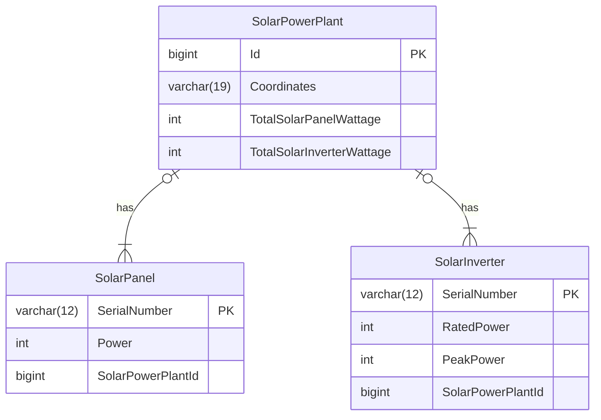

# Jambo Web API
<p align="center">

</p>

## Overview
This project serves as an experimental exploration of the ASP.NET Core framework within the context of photovoltaic solar energy. It focuses on three core model classes: solar panels, solar inverters, and solar power plants.

## Entity Relationship Diagram


## Tools
- [.NET](https://dotnet.microsoft.com)
- [MySQL](https://www.mysql.com)
- [Docker](https://www.docker.com)
- [Postman](https://www.postman.com)

## Architecture
For this practice, MVC and REST were utilized separately. The view layer is responsible for displaying data (using the GET method), while the POST method is accessible through API testing platforms such as Postman or Insomnia. A collection of requests can be found in the [Jambo.postman_collection.json](https://github.com/igor-u/jambo-web-api/blob/main/Jambo.postman_collection.json) file. The collection can be imported into either tool to execute the requests after running the project.

## Objectives
- Learn about the C# programming language
- Learn more about object relational mapping
- Learn how to containerize a .NET application.

## Database
This project utilizes MySQL as the primary database. The connection between the ASP.NET application and the MySQL server is established using [Pomelo.EntityFrameworkCore.MySql](https://github.com/PomeloFoundation/Pomelo.EntityFrameworkCore.MySql), an open-source provider for Entity Framework Core that supports MySQL.

* Server: Localhost was used.
* MySQL Server: Ensure the MySQL server is operational:

<p align="center">

</p>

**To create the database, along with its tables**:
- Navigate to the project's root directory in your terminal.
- Apply migrations:
```
dotnet ef database update
```

## Tests
To run the tests in this .NET application, execute the following command in the project's root directory:
```
dotnet test
```

## Running the Project
This project can be run in two ways:

1. Using `dotnet run`

- Navigate to the project's root directory in your terminal.
- Run the following command:
```
dotnet run
```
The application will start and be accessible through `http://localhost:5171`.

2. Using Docker

- Navigate to the project's root directory in your terminal.
- Build the Docker image:
```
docker build -t jambo-web-api .
```
Run a container using the built image:
```
docker run --network host jambo-web-api --rm
```
The `--network host`  parameter is used to make the container share the host machine's network. This allows the container to directly access local services, such as the database.

The application will start and be accessible through `http://localhost:8080`.
